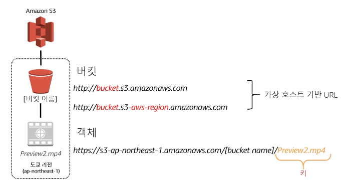
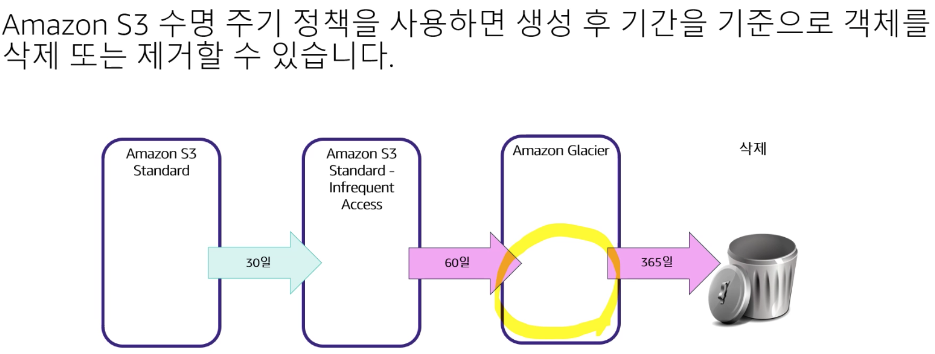
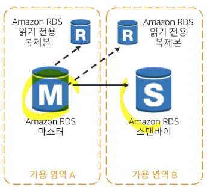
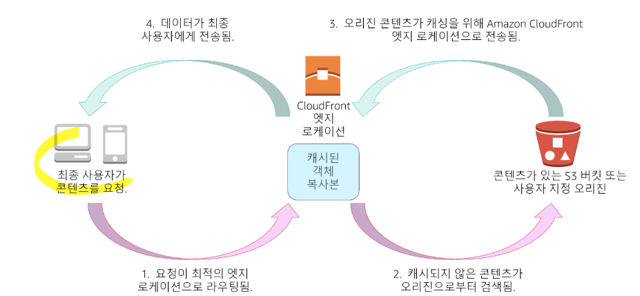
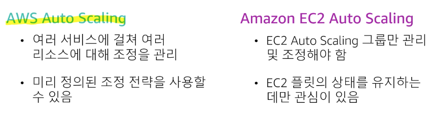
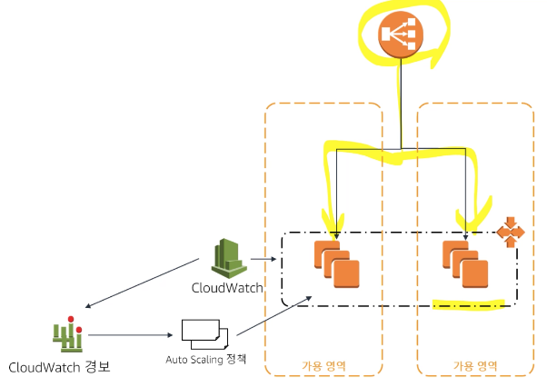

# AWS 공인 솔루션스 아키텍트 2영역(어소시에이트)

### 1. 성능이 뛰어난 스토리지 및 데이터베이스 선택

---

- S3
    - S3 path

        

    - 결제 모델
        - 사용한 만큼만 비용을 지불 (월별 GB, 리전 밖으로 전송, PUT COPY POST LIST 및 GET 요청
        - 무료 (S3로 전송, S3에서 동일한 리전의 다른 서비스로 전송)
    - 스토리지 클래스
        - Standard - 재해복구/비즈니스 연속성: 교차 리전 복제를 사용
        - Standard-Infrequent Access -
         액세스가 빈도가 낮은 데이터 
        (저렴하나 데이터 복구, 
        액세스 비용이 높음, 
        최소 30일 스토리지)
    - 수명 주기 정책

        

- DynamoDB
    - 읽기/쓰기 처리량 용량 요구 사항을 기반으로 리소스 할당
    - 읽기 용량 유닛(최대 4KB 크기의 항목에 대해)
        - 초당 1건의 강력한 일관된 읽기
        - 초당 2건의 최종적 일관된 읽기
    - 쓰기 용량 유닛 (최대 1KB 크기의 항목에 대해)
        - 초당 1건의 쓰기

- Amazon RDS
- RDS 사용이 적합한 경우
    - 복잡한 트랜잭션 또는 복잡한 쿼리
    - 중간 또는 높은 수준의 쿼리 / 쓰기 속도
    - 단일 작업자 노드/샤드를 사용
    - 높은 내구성
- RDS 사용이 적합하지 않은 경우
    - 대규모 읽기 / 쓰기 속도
    - 샤딩
    - 간단한 GET/PUT dycjd alc znjfl
    - RDBMS 사용자 정의
- RDS  읽기 전용 복제본
    - 향상된 성능 및 내구성
    - 탄력적으로 용량 확장
    - 대량의 애플리케이션 읽기 트래픽
    - 읽기 전용 복제본을 독립 실행으로 승격

        

        - 리전간 데이터 복제
            - S3 - 리전간 복제 / 1:1로 1개의 리전에 데이터를 복제
            - DynamoDB - 글로벌 테이블 / 여러 리전의 테이블간 비동기 복제
            - RDS Aurora -글로벌 데이터베이스 / 1:n으로 복수의 리전에 1초 미만 지연시간으로 데이터 복제

### 2. 캐싱을 적용하여 성능 개선

---

- Amazon CloudFront
    - 콘텐츠 - 정적 및 동적
    - 오리진 - S3, EC2, ELB, 온프레미스 서버
    - 프라이빗 콘첸츠 보호
    - 보안 개선 
    (AWS Shield 스탠다드 및 고급 버전,
     AWS WAF)
    - 캐싱

        

- ElasticCache
    - Memcached
        - 멀티 스레딩
        - 유지 관리 용이
        - Auto Discovery를 통한 간편한 수평 확장
    - Redis
        - 데이터 구조 지원
        - 지속성
        - 원자 조작
        - Pub/Sub 메시징
        - 읽기 전용 복제본/ 장애 조치
        - 클러스터 모드/ 공유도니 클러스터

### 3. 탄력성과 확장성을 갖춘 솔루션 설계

---

- Auto Scaling
    - 인스턴스 시작 또는 종료
    - 새 인스턴스를 로드밸런서에
    자동으로 등록
    - 여러 가용 영역에 걸쳐 식작이 가능
    - ELB와 통합
    - AWS Auto Scaling vs 
    Amazon EC2 Auto Scaling

    

- AWS CloudWatch
    - 모니터링 대상 : 
    CPU, 네트워크, 대기열 크기 + 
    사용자 지정 지표

        

2영역 고려사항

- 전략적으로 캐싱을 사용하여 성능을 개선한다.
- 데이터가 구조화되지 않은 경우, S3가 일반적인 스토리지 솔루션이다.
- Auto Scaling을 사용해야 하는 시기와 이유를 파악한다.
- 자신의 워크로드와 성능 요구에 가장 적합한 인스턴스 및 데이터베이스 유형을 선택한다.
