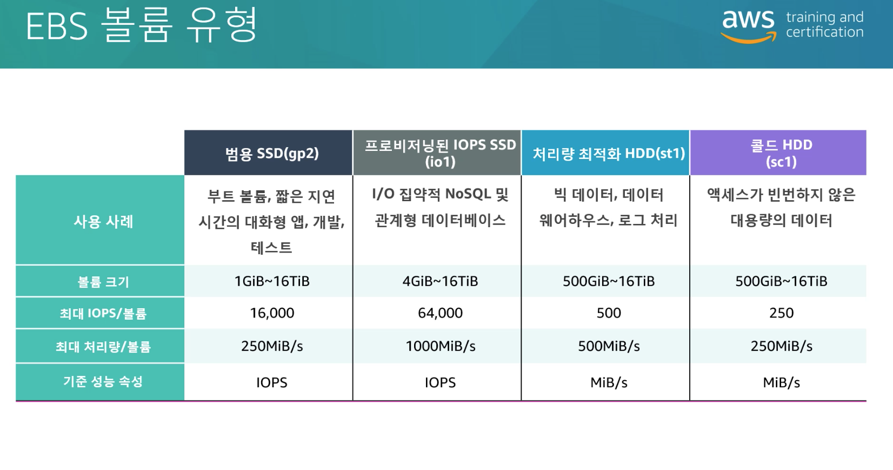
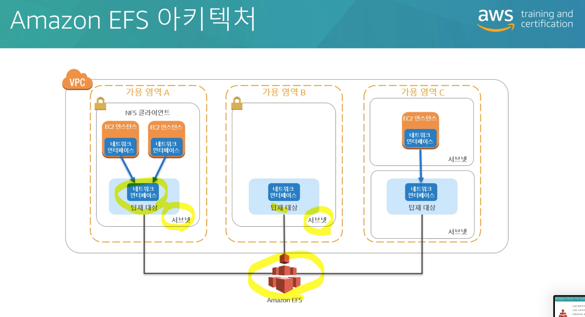
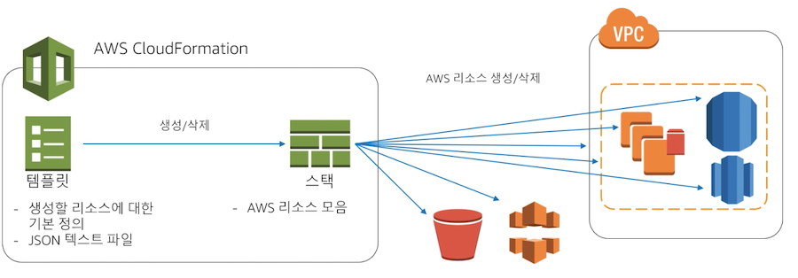

# AWS 공인 솔루션스 아키텍트 1영역(어소시에이트)

### TIP.

1. 시험 시간 30분 추가 (http://bit.ly/MORE_TIME) - 신청 전에 미리 추가해야 함

2. AWS 학습 자료집 (http://bit.ly/aws-study-resource) 

3. AWS 수험 가이드 (http://bit.ly/saaguide)

### 1. 안정적이고 복원력을 갖춘 스토리지 선택

---

- Amazon EC2 인스턴스 스토어
    - 블록 수준 스토리지를 제공
    - EC2 인스턴스와 동일한 가용 영역에 연결
    - 디스크 유형과 용량은 인스턴스 유형에 따라 결정
    - 애플리케이션 수준 내구성

- Amazon EBS (Elastic Block Store)
    - 블록 수준 스토리지 제공
    - EC2 인스턴스와 동일한 가용 영역에 연결
    - 인스턴스와 독립적으로 지속
    - 신속한 데이터 엑세스와 장기지속성을 제공
    - 스냅샷

        

### 2. AWS 서비스를 사용하여 결합 해제 메커니즘을 설계하는 방법 결정

---

- ELB - 로드밸런서
    - NLB
        - 4 계층 작동
        - TCP 패킷의 로드밸런싱
        - 고성능 애플리케이션의 경우
        - 고정된 IP 주소
    - ALB
        - 7 계층 작동
        - 요청의 내용에 따라 트래픽 라우팅
        - TLS 암호를 사용하여 데이터를 암호화/암호화 해제

- Auto Scaling 정책
    - 대상 추적 조정 정책 
    ( ex. CPU 50% 유지)
    - 단계 및 단순 조정 정책 
    (ex. CPU 사용률이 60% 이상 
    인스턴스 1개 추가, 80% 이상 2개 추가)
    - Amazone SQAS에 따른 조정 
    (ex. SQS의 대기열 메시지 수가 
    1000을 넘을 경우 인스턴스 추가)

### 3. 멀티 티어 아키텍처 솔루션을 설계하는 방법 결정

---

- Amazon Elastic File System (EFS)
    - AWS 클라우드의 파일 스토리지
    - 공유 스토리지
    - 페타바이트 규모 파일 시스템
    - 탄력적 용량
    - NFS v4.0 및 4.1(NFSv4) 프로토콜
    - Amazone EC2용 Linux 기반 AMI 호환성

        

- Amazone Glacier
    - 데이터 백업 및 아카이브 스토리지 
    (장기간 보관에 유리)
    - 저장소 및 아카이브
    - 검색 - 가속, 스탠다드, 벌크 (검색 시 비용이 들 수 있다)
    - 암호화
    - Amazone S3 객체 수명 주기 정책에 사용
    - 리전 가용성
    - 뛰어난 내구성

- Amazon S3
    - 사실상 무제한의 용량
    - 리전 가용성
    - 뛰어난 내구성 - 99.99999999999%
    - 스토리지 클래스 및 내구성
    - 암호화(저장 데이터) -
     SSE-S3, SSE-KMS, SSE-C
    - 암호화(전송 데이터) - TLS
    - 신속한 데이터 복구를 위한 버전관리
    - 객체 단위 저장 시스템, 
    파일이 변경되면 객체가 변경되어 저장
    - 액세스 제어 종류 - 
    객체 ACL, 버킷 ACL, 버킷정책 & IAM 정책

### 4. 고가용성 및 또는 내결함성을 위한 설계

---

- 내결함성 → 시스템이 소결합 될수록 더 쉽게 확장되며 내결함성도 강화할 수 있다.
- AWS CloudFormation
    - AWS 리소스를 일관되고 재현 가능한 방식으로 배포하고 관리하기 위한 서비스

        )

- AWS Lambda
    - 완전 관리형 컴퓨팅 서비스
    - 이벤트에 대한 응답으로 또는 시간 기반 간격으로 상태 비저장 코드를 실행
    - EC2 인스턴스와 같은 인프라를 관리하지 않고 코드를 실행

1영역 고려사항

- "단일 AZ"는 정답이 아닐 것이라고 예상
- AWS 관리형 서비스의 사용이 항상 선호됨
- 내결함성과 고가용성은 같은 개념이 아님
- 언젠가는 장애가 발생할 것으로 예상하고 이에 맞춰 설계
