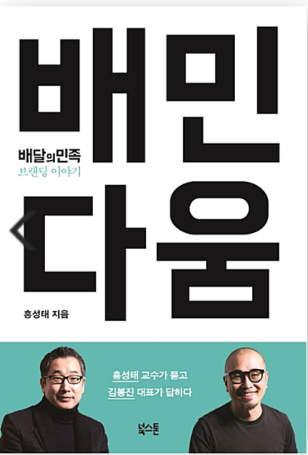

# 배민다움

## 배민다움이라는 책을 접하게 된 이유   
2년 전 개발자를 준비하던 때부터 정말 가고 싶었던 기업 이었기에 우아한형제들만의 문화와 가치관, 이념 등에 더욱 많이 알고 싶어 책을 읽기 시작했습니다.  
배민다움이라는 책 안에는 배달의 민족의 시작부터 지금까지의 여러 과정들이 담기었는데 하나하나 인상 깊었던 부분들이 많았습니다.  
그래서 제가 개인적으로 따로 모아놓고 싶어 마음에 와닿았던 부분들만 정리하여 보았습니다.  
만약 스타트업을 꿈꾸는 사람이라면 한번 쯤 읽어보시면 좋을 것 같습니다 :)  

## 마음에 와닿았던 부분들
- 핵심가치가 기본에 뿌리내리지 않으면 어떤 것도 이룰 수 없다. (근면성실, 새시대 새일꾼, 근검절약)
- 방향성 없는 열정은 위험하다. 처음부터 열정만 넘치면 주변 사람들까지 부담스럽다. 
막연한 열정 또한 좋지 않다.
- 우아한 형제들의 핵심 역량은 우리만의 시각으로 세상을 바라볼 수 있는 것.
- 자기 이야기를 하지말고 고객의 이야기를 하라.
- 레고나 디즈니가 잘되는 것도 레고나 디즈니를 좋아하는 사람들이 들어와서 문화를 만들었기 때문이다.
- 내부 구성원들은 원래 자신이 고객에게 제공하는 서비스를 지독하게 좋아하는 친구들이어야 한다.
- 푸드 e-커머스 시대가 온다.
- 자유와 자율은 다르다. 규율을 포기하는 순간 성공은 멀어지게 된다
- 일에 대한 스트레스는 건강한 스트레스다. 적당한 스트레스는 업무를 도전적으로 받아들이게하고 성장 촉진제가 되기도 한다.
- 개인이 아닌 팀을 중요시 한다.
- 잡답은 신뢰가 쌓이고 유대관계가 생기게 한다.
- 배민은 우리 문화에 익숙한 사람, 우리 문화를 계속 좋아하고 성장 시킬 사람을 찾는다.
- 정확한 정보를 얼마나 가지고 있느냐가 좋은 전략수립의 80% 이상을 차지할 정도로 중요하다.
- 능력이 어느정도 수준 이상이면 성실한 사람, 그리고 재능이 많은 사람 보다는 코드가 잘 맞는 사람이 더 중요하다.
- 겸손함과 배우고 싶은 마음이 중요하다.
- 열정은 주어진 일만 하는게 아니라 나의 하루하루가 점점 좋아지는 것이다.
- 일이란 나 자신을 완성해갈 수 있는 가장 강력한 수련의 도구다. 
그 일을 통해서 꾸준히 반복적으로 한단계, 더 높은 단계로 나를 수련해 나가야 한다.
- 만들고 싶은 브랜드를 만들기 위해서는 사업을 잘해야한다.
- 아이디어는 문제를 어떻게 해결하느냐가 아니라 문제 자체를 찾는 데서 나온다.
- 소비자의 고충이 있는 곳에 기회가 있다.
- 배수진을 치며 간절함으로 창업했다고 꼭 성공하는 것이 아니다. 성공한 기업가들은 오히려 일반인보다 위험회피 성향이 강하다.
- 그는 우리처럼 평범한 사람이었다. 그런데도 에이브러햄 링컨이 되었다.
- 책이란 무릇, 우리 안에 있는 꽁꽁 얼어버린 바다를 깨드려 버리는 도끼가 아니면 안되는 것이다.
- 핵심을 찾으려면 응축해라. 응축의 결과보다 더 중요한 것은, 핵심에 다가가는 고심의 과정이다.
- 모든 사람을 만족시키려면 아무도 만족할 수 없고, 단 한사람을 제대로 만족시키면 모두가 만족한다.
- 나는 성공의 열쇠는 모른다. 그러나 모든 사람을 즐겁게 하려고 노력하는 것이 실패의 열쇠라는 것은 안다.
- 친구를 가까이 두어라, 그러나 적은 더 가까이 해라.
- 배민은 핵심고객의 문화를 이해하면서 성장한 회사다.
- 배민의 궁극적인 경쟁사는 자신이다. 배민을 넘어서서 어떤 세상을 만들 것 인가에 대해 집중한다.
- 1등은 문화를 이야기하고 2등은 기능을 이야기한다.
