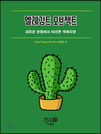

# 엘레강트 오브젝트

> "성공적인 절차지향 개발자에서 성공적인 객체지향 개발자로 탈바꿈하기 위한 첫 걸음은 뇌의 일부를 잘라내는 것이다"  
> 데이비드 웨스트(Davide West)

# Contents

## [출생](https://github.com/leeyohan93/TIL/blob/master/book/%EC%97%98%EB%A0%88%EA%B0%95%ED%8A%B8_%EC%98%A4%EB%B8%8C%EC%A0%9D%ED%8A%B8/%EC%B6%9C%EC%83%9D.md)
- 1.1 -er로 끝나는 이름을 사용하지 마세요  
- 1.2 생성자 하나를 주 생성자로 만드세요  
- 1.3 생성자에 코드를 넣지 마세요

## [학습 1/3](https://github.com/leeyohan93/TIL/blob/master/book/엘레강트_오브젝트/학습1.md)
- 2.1 가능하면 적게 캡슐화하세요
- 2.2 최소한 뭔가는 캡슐화하세요
- 2.3 항상 인터페이스를 사용하세요
- 2.4 메서드 이름을 신중하게 선택하세요

## [학습 2/3](https://github.com/leeyohan93/TIL/blob/master/book/엘레강트_오브젝트/학습2.md)
- 2.5 퍼블릭 상수(public constant)를 사용하지 마세요
- 2.6 불변 객체로 만드세요

## [학습 3/3](https://github.com/leeyohan93/TIL/blob/master/book/엘레강트_오브젝트/학습3.md)
- 2.7 문서를 작성하는 대신 테스트를 만드세요
- 2.8 모의 객체(Mock) 대신 페이크 객체(Fake)를 사용하세요
- 2.9 인터페이스를 짧게 유지하고 스마트(smart)를 사용하세요

## [취업](./취업.md)
- 3.1 5개 이하의 public 메서드만 노출하세요
- 3.2 정적 메서드를 사용하지 마세요
- 3.3 인자의 값으로 NULL을 절대 허용하지 마세요
- 3.4 충성스러우면서 불변이거나, 아니면 상수이거나
- 3.5 절대 getter와 setter를 사용하지 마세요
- 3.6 부생성자 밖에서는 new를 사용하지 마세요
- 3.7 인트로스펙션과 캐스팅을 피하세요
