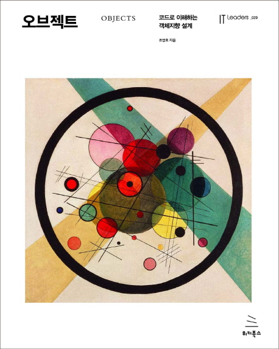

# 오브젝트
> 오브젝트를 읽고 난 후 개인적인 정리입니다.
>

### 1. 객체, 설계
### 2. 객체지향 프로그래밍
### 3. 역할, 책임, 협력
### 4. 설계 품질과 트레이드오프
### 5. 책임 할당하기
### 6. 메세지와 인터페이스
### 7. 객체 분해
### 8. 의존성 관리하기
### 9. 유연한 설계
### 10. 상속과 코드 재사용
### 11. 합성과 융녀한 설계
### 12. 다형성
### 13. 서브클래싱과 서브타이핑
### 14. 일관성 있는 협력
### 15. 디자인 패턴과 프레임워크
### 부록A. 계약에 의한 설계
### 부록B. 타입 계층의 구현
### 부록C. 동적인 협력, 정적인 코드