# 인수테스트 주도 개발 

- [Repository](https://github.com/leeyohan93/atdd-subway-admin)
- [Step1 PullRequest](https://github.com/next-step/atdd-subway-admin/pull/5)
- [Step2 PullRequest](https://github.com/next-step/atdd-subway-admin/pull/12)
- [Step3 PullRequest](https://github.com/next-step/atdd-subway-admin/pull/41)
- [Step4 PullRequest](https://github.com/next-step/atdd-subway-admin/pull/60)

## 피드백 모음

### 꼭 받아보고 싶었던 재석님 리뷰 
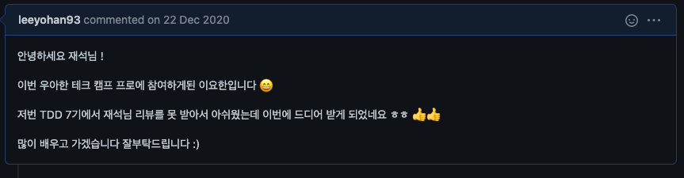

### 궁극적인 목표는 좋은 소프트웨어 만드는 것입니다.
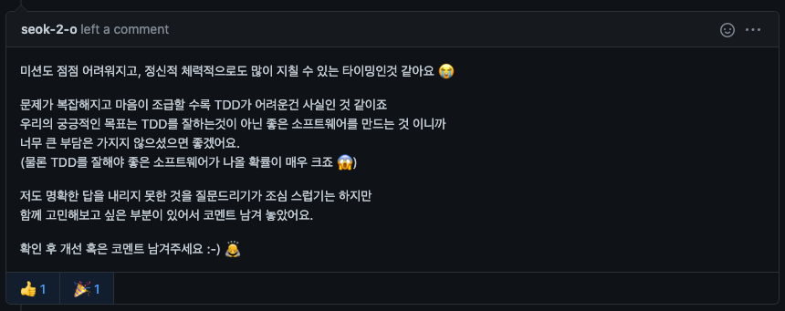

### DTO의 변환 로직을 캡슐화를하면 더욱 가독성 있게 사용이 가능하다.(도메인에 적용은 힘들 수도)

### 사용자 정의 Exception의 올바른 사용방법
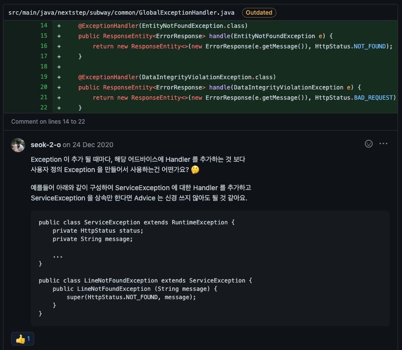
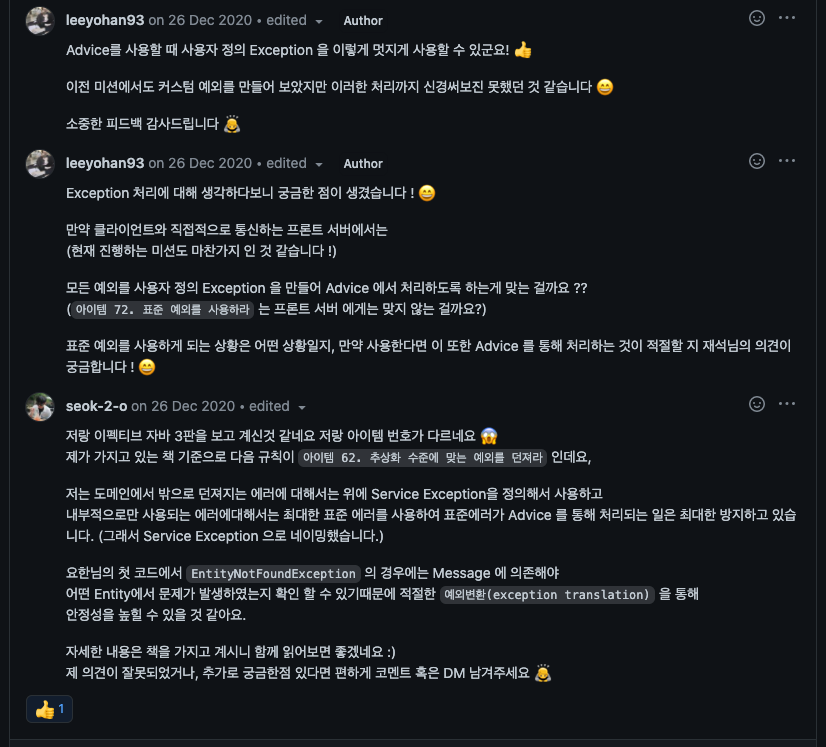

### 메서드 네이밍이 이상하다면 메서드가 하는 일을 의심해 보아야 한다

### 빌더 패턴을 사용하자
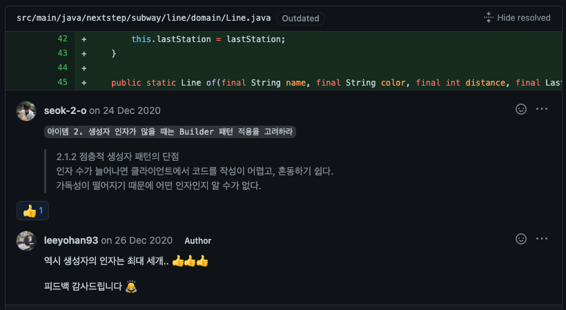

### 상황에 명확한 예외하자
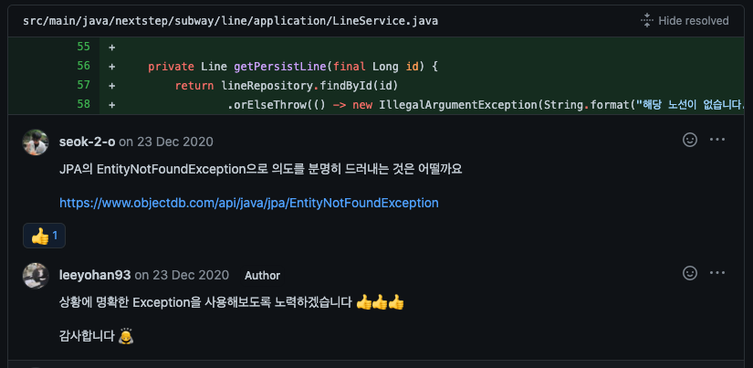

### 서비스 레이어의 메서드 네이밍 컨벤션에 대해
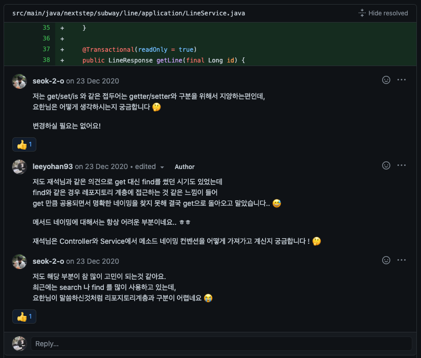

### 항상 오버엔지니어링을 조심하자
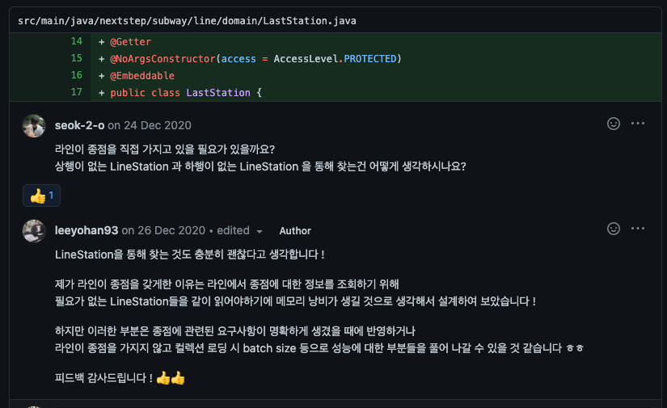

### 인수 테스트의 작성의 적절한 스코프
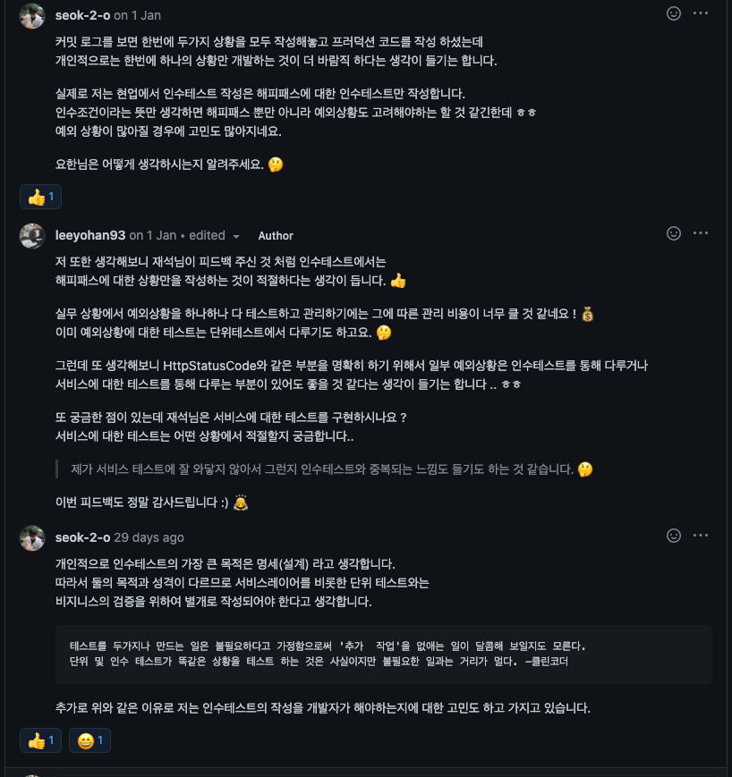

### 자주 사용하지 않는 코드는 나쁘다
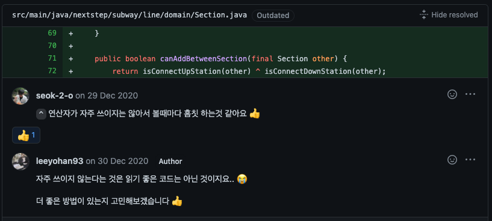

### 정렬에 대한 고민
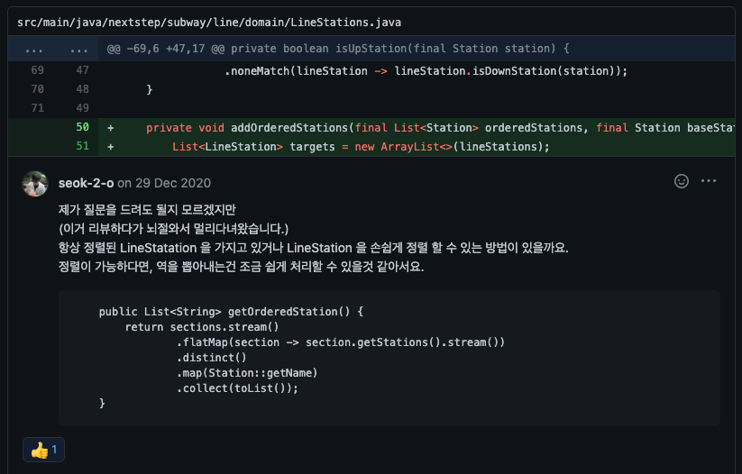
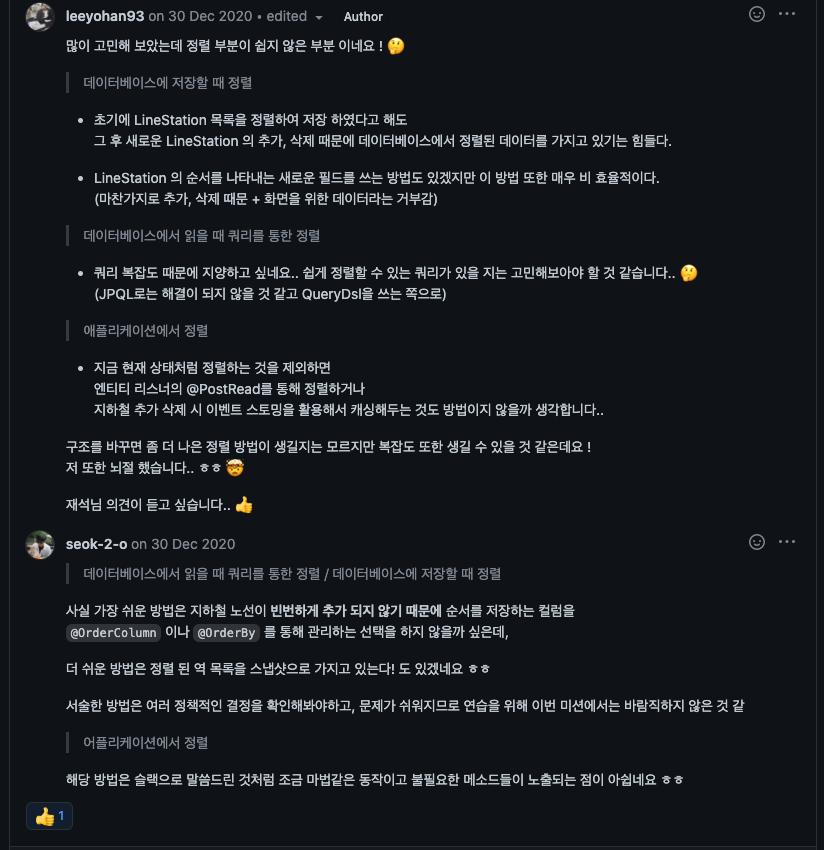

### 캐싱을 사용하라
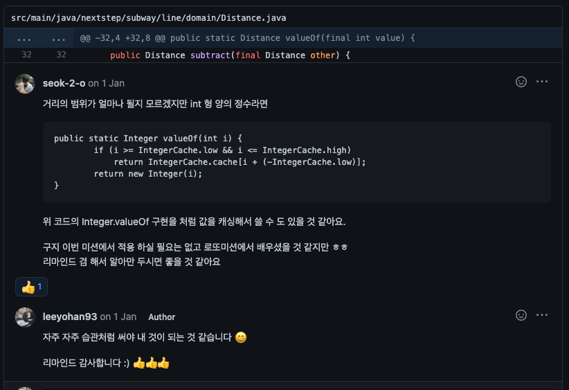

### 테스트의 검증을 명확히하자
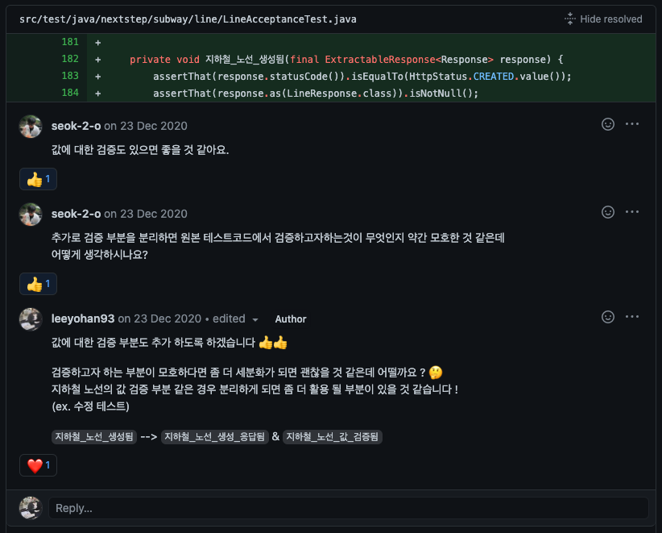
