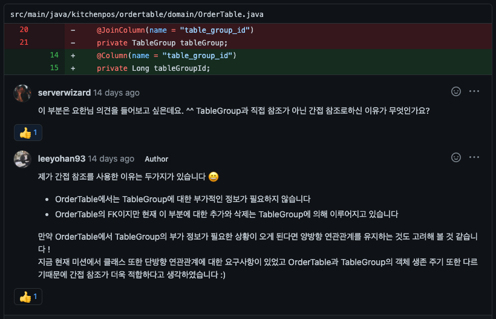
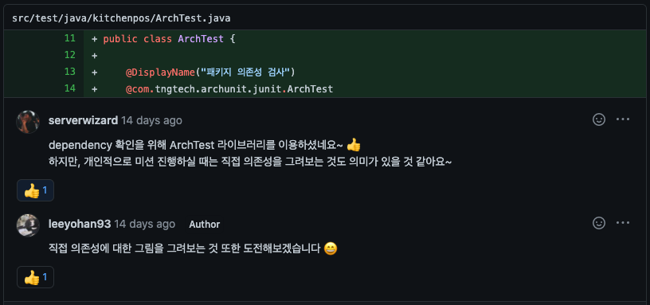
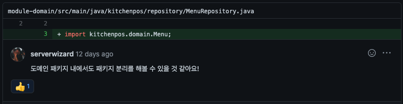
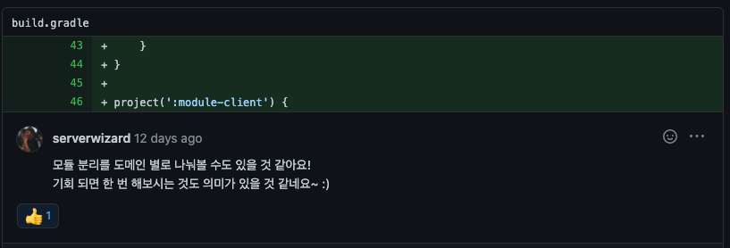
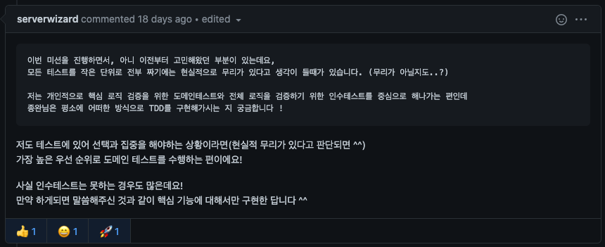
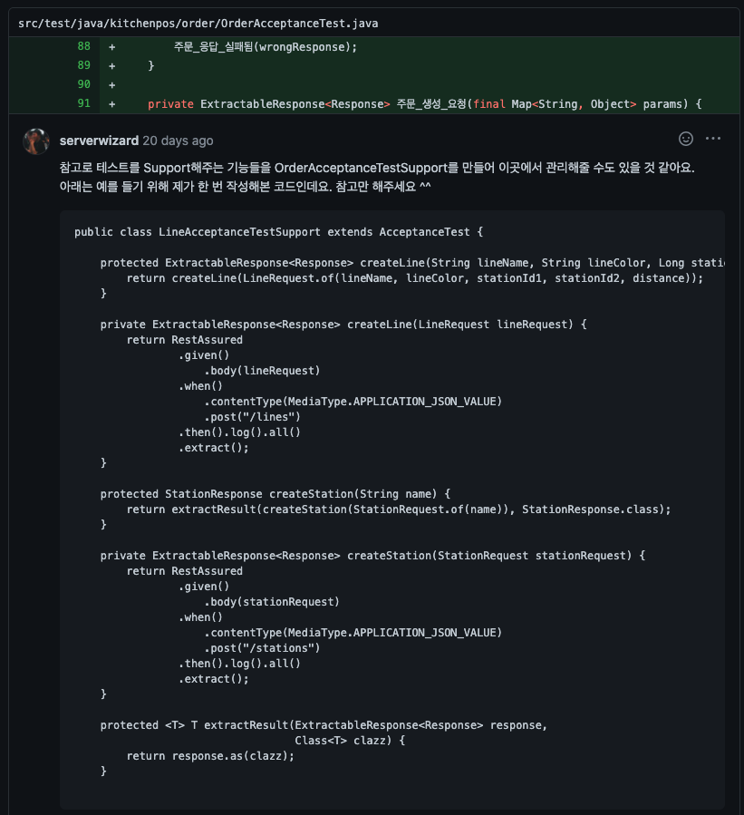
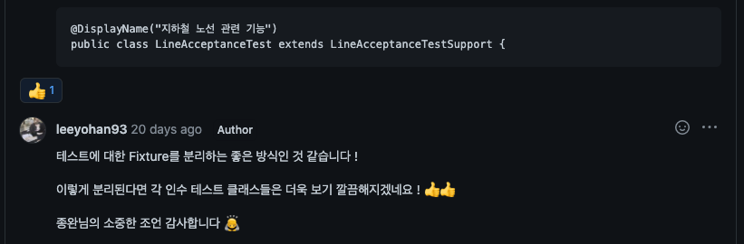
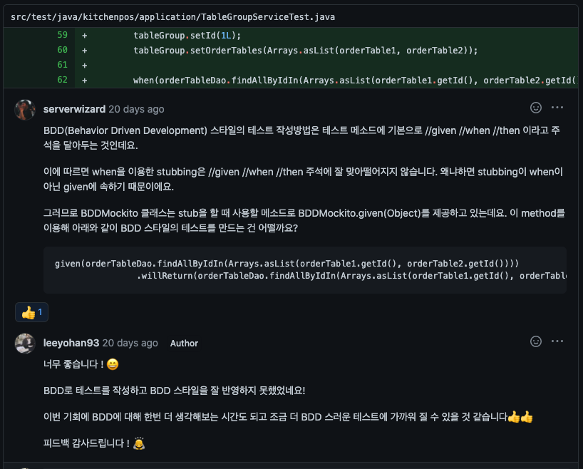

# 레거시 코드 리팩터링 

- [Repository](https://github.com/leeyohan93/jwp-refactoring)
- [Step1 PullRequest](https://github.com/next-step/jwp-refactoring/pull/19)
- [Step2 PullRequest](https://github.com/next-step/jwp-refactoring/pull/31)
- [Step3 PullRequest](https://github.com/next-step/jwp-refactoring/pull/38)

## 피드백 모음

### 트랜잭션 고립성과 전파속성

### 객체의 관계에서 간접 참조를 하는 이유

### 객체 의존성을 그려보자

### 멀티모듈 팁

### 테스트가 힘든 상황

### 테스트 픽스쳐를 만들자

### BDD 스타일의 테스트 작성 방법 (BDDMockito)
 
