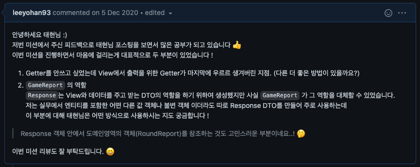

# 자동차 경주 - 단위테스트

- [Repository](https://github.com/leeyohan93/java-racingcar)
- [Step1 PullRequest](https://github.com/next-step/java-racingcar/pull/1589)
- [Step2 PullRequest](https://github.com/next-step/java-racingcar/pull/1624)
- [Step3 PullRequest](https://github.com/next-step/java-racingcar/pull/1660)
- [Step4 PullRequest](https://github.com/next-step/java-racingcar/pull/1684)
- [Step5 PullRequest](https://github.com/next-step/java-racingcar/pull/1698)

## 피드백 모음

### getter와 Response DTO 의 사용에 대한 질문

### getter를 지양하는 이유

### Response DTO 사용 팁

### 객체의 생성 분리와 객체지향

### 표준 예외를 사용하라

### 테스트의 메서드 이름을 한글로 사용하기

