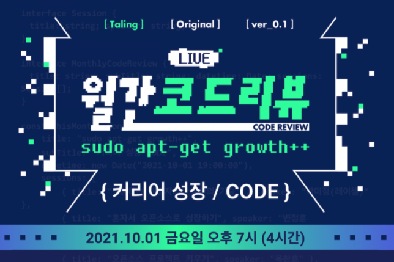

# 월간 코드리뷰 ver_0.1 : 커리어 성장 CODE 세미나 후기

탈잉이 주최한 개발자를 위한 세미나, [월간 코드리뷰](https://taling.me/Talent/Detail/38586) 에 참석하였습니다.

제가 개인적으로 세미나를 들은 후 느낀 생각은 `이 세미나를 꼭 다른 동료 개발자에게 추천해주어야 겠다` 였습니다.
무려 5분의 연사와 함께 4시간을 넘어 자정이 되는 시간까지 달렸는데, 좋은 연사분들이 무려 5분이나 계시다는 것과 **, 
넉넉한 세미나 시간**으로 더욱 많은 질문들을 주고받을 수 있었던 것이 인상 깊습니다. 그 이외에도 좋았던 점을 보자면,   

- 각기 다른 주제로 지루할 틈이 없음
- 자유로운 분위기, 시니어 개발자에게 자유롭게 질문하고 잡담하며 함께 공유할 수 있었던 분위기
- 커리어나 취업, 이직에 대한 진솔한 시니어 개발자들의 이야기
- 현업에서의 문제해결에 대한 팁과 노하우
- **연사자들의 입이 터진 세미나**

위와 같이 꽤나 많은 점들을 이야기할 수 있을 것 같습니다.
이번 세미나의 주제는 **성장**이였는데요, 개인적으로 얻어간 것들이 굉장히 많았습니다.
다음 세미나에서는 개발자의 코드리뷰에 대한 주제로 세미나가 진행된다고 하니, 함께 참여해보시면 좋을 듯합니다.

---

## 나대기에도 목표가 필요해 - 박미정 님

- 블로그를 하는 이유
    - 내 지식에 파묻히지 않게 하기 위해서 → 피드백을 받아 내 생각이 잘못되었더라면 고쳐나갈 것이다.
    - 블로그 쓰는 팁 → 내가 잘 읽히는 블로그의 템플릿을 따라해보자.
- 깃허브 책을 출간한 이유
    - 왜 나는 계속 팀원에게 깃과 관련한 질문을 받을까?
    - 이미 포화되어 있는 자료라고 생각했지만, 필요한 부분이었다.
- 계획의 중요성
    - 계획도 없이 미뤄진다면 정말 끝이 없다.
- 공유의 중요성
    - 스스로 왜? 라는 질문에 답변을 할 수 있다면 충분히 공유할만한 주제인다.
    - 모든 것의 마무리는 공유 이후에 피드백 수집이다.

## 혼자서 오픈소스로 성장하기 - 아웃사이더 님

## 개발자의 슬기로운 발표 생활 - 치즈 님

- 발표 경험이 중요한 이유
    - 너무 많은 잘하는 개발자들에서 나만의 강점을 만든다. → 자기 브랜딩, 나의 가치 성장
    - 몸 값 성장, 커리어 성장 → 더 넓은 커리어 성장으로 이어짐
- 발표 기회를 만드는 방법
    - 발표는 내 견해/관점을 공유하는 것 (이미 다 아는 것과는 관계가 없다.)
    - 내가 경험한것을, 나의 관점으로 이야기하는 것
    - 평소에 발표할 생각으로 정리해두기
    - 발표 거리 찾기
        - 결론 - 문제 - 해결
        - 응답 속도 개선 / 사용자가 많아져서 응답속도 느려짐 / 쿼리 병목 발견, 인덱스와 조인문으로 개선
        - 컨퍼런스 마다 타겟 청중이 다르기 때문에 다른 방법,난이도,주제로 우려먹기 가능
    - 발표할 곳 찾기
        - 오프라인 코드 리뷰, 스크럼, 주간 회의
        - 스터디 리딩, 지식 공유, 커뮤니티
    - **선 지름 후 수습**
        - 성장은 항상 불편함과 고통 속에서
        - 기회가 나를 찾아올때까지
- 발표 기회를 놓치지 않는 방법
    - 말이 정리가 안될때는 짧게, 핵심 먼저 전달!
    - 모든 이야기 전달 < 중요한 내용 전달
    - 익숙하지 않아 주목받고 떨린다면, 익숙해질 때까지 연습이 중요하다
    - 어려운 것 = 익숙하지 않은 것
- 발표로 배운 점
    - 공유의 즐거움
    - 내가 성장에 목마를 때 힘들었던 것: 뭘 모르는지 모를 때
    - 내 성장, 함께 성장
- 기억에 남는 이야기
    - 내가 다른 거인의 어깨에 올라 가듯 내 어깨에 다른 사람이 올라왔으면 좋겠다.
    - 모든 사람을 만족시킬 수는 없다. 내가 타겟으로 하고 있는 그분들이 잘 들었다면 그것으로 충분한 자격이 있다.

## 오픈 소스 프로젝트 키우기 - 옥찬호 님

1. 어떤 오픈 소스 프로젝트를 만들까 ?
    - 무엇이든 좋으니, 하고 싶은 것을 하자.
    - 시작이 반이다
2. 프로젝트 프로토타입 만들기
    - 지금 당장 필요한 기능을 생각해보고 나머지는 일단 모두 지운다.
    - 동기 부여는 시간이 지날수록 바닥을 치게 된다.
        - 동기 부여의 추락을 막으려면 짧은 성공을 통해 동기 부여를 하는 것이 중요하다.
3. 써레질-빌드/배포 자동화 및 각종 툴 설치
    - 유명한 오픈 소스의 공통점
    - CI/CD
        - 지속적인 통합: 여러 개발자가 작성하거나 수정한 소스를 지속적으로 통합하고 테스트 하는 것
        - 지속적인 배포: 개발,통하배,배포,릴리즈,테스트를 자동화해 지속적으로 배포하는 것
    - 코드 커버리지
    - 정적 코드 분석
4. 모내기 - 협업을 위한 준비 및 홍보
    - 어떻게 사람들이 기여할 수 있도록 할까?
        - 프로젝트 설치 및 사용 방법 알려주기
    - 프로젝트 코드 구조 문서화하기
        - 기여자의 이해를 돕는다
    - 기여 방법 단계별로 알려주기
        - 커밋 컨벤션 또는 규칙들을 단계별로 알려주면 좋다.
        - ex) Pull Requests 문서 공유
    - 도움이 필요한 부분 등록하기
        - 이슈 등록을 해놓고 누군가의 도움을 기다려본다.
    - 질문/답변을 위한 창구 만들기
        - 깃허브의 이슈와 같은 부분보다 빨리 주고받을 수 있는 창구를 만들어 놓자.
    - 오픈 소스 체크리스트 확인하기
        - [https://opensource.guide/ko/starting-a-project/](https://opensource.guide/ko/starting-a-project/)
    - 오픈 소스 알리기
        - 페이스북, 트위터
5. 제초 - 이슈 및 코드 리뷰 대응
    - 이슈 템플릿 작성하기
        - 이슈 템플릿을 통일시키고 싶다면 템플릿을 작성해두자.
    - PR 템플릿 작성하기
    - 이슈 대응하기
    - 코드 리뷰하기
        - 코드에 대한 이야기가 필요하다면 적극적으로 논의 하자
6. 추수 - 다음 단계를 위한 준비
    - 고생하셨습니다. 이제 프로젝트가 궤도 위에 올랐습니다.
- QnA
    - 학습 목적의 오픈 소스 프로젝트 기준은?
        - 알고 싶었던 부분과 새롭게 공부하고 싶은 부분에 따라 선정

## Zero to Hero_Developer Roadmap - 이수진 님

## 소회

- 박미정님의 소회
    - 개발의 지름 길은 없다.
    - 남들이 하는 것을 하지말고 본인이 필요하고 하고싶은 것들을 찾아가면서 자신만의 강점을 만들어간다면 더욱 성장할 수 있찌 않을까.
- 치즈님의 소회
    - 개발에 왕도가 없는 곳에서 왕도가 있는 것처럼 이야기하는 것에 대한 막연함
    - 치즈님도 주니어 때 많이 방황했고 그 시절에는 시니어와 비교하고 자취들을 쫓아갔다. → 시간이 오래걸리는 건 어쩔 수 없는 것 같다.
    - 시니어 개발자의 발자취를 바라보지 않고 현재 실력만 바라본다면 당연히 엄청난 것이다. 지나온 발자취를 보고 나 또한 그 발자취를 걸어가자.
- 옥찬호님의 소회
    - 개발 실력이 가장 많이 늘었던 두가지
    - 일상적으로 개발을 하던 시간보다는 어떤 것에 막혀서 오랜시간 고민하고 수정하고 알게 되었을 때 지식이 쌓이고 가장 많이 성장했던 것 같다.
    - 불편한 환경, 새로운 도전에서 오는 성장. 큰 폭에서 오는 성장은 이전에 했던 것과 다른 도전에서 오는 것
    