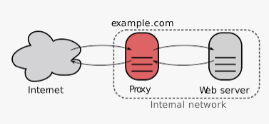

# 네트워크 프록시와 로드 밸런서

## 프록시 서버란?
프록시 서버는 클라이언트가 자신을 통해서 다른 네트워크 서비스에 간접적으로 접속할 수 있게 해 주는 컴퓨터 시스템이나 응용 프로그램을 가리킨다.  
서버와 클라이언트 사이에 중계기로서 대리로 통신을 수행하는 것을 가리켜 '프록시', 그 중계 기능을 하는 것을 프록시 서버라고 부른다.

## 프록시 서버 구성

### Forward Proxy

일반적으로 프록시라고 말하면 프론트 프록시를 말하는 것이다.  
클라이언트와 인터넷 사이에 위치하여 중계하는 방식으로 아래와 같은 이점을 가진다.

- 캐싱: 클라이언트의 요청을 캐싱
    - 전송 시간 절약
    - 불필요한 외부전송 X
    - 외부 요청 감소로 네트워크 병목현상 방지
    
- 익명성 보장: 클라이언트의 익명성을 보장
    - 서버는 실제 요청자에 대해 알지 못하고 Forward Proxy의 존재만 알 수 있다.

### Reverse Proxy

인터넷과 서버 사이에 위치하여 중계하는 방식이다.  
클라이언트로부터의 요청이 웹서버로 전달되는 도중의 처리에 끼어들어서 다양한 전후처리를 시행할 수 있으며 아래와 같은 이점을 가진다.

- 보안강화
    - 클라이언트는 통신하는 서버의 정보를 알 수 없고 Reverse Proxy의 존재만 알 수 있다.
- 확장성 및 유연성 향상임
    - 클라이언트는 Reverse Proxy의 주소만 볼 수 있으므로 백엔드 인프라 구성을 자유롭게 변경 가능
- 웹 가속
    - 서버 응답을 클라이언트로 반환하기 전에 압축(gzip)하면 필요현 대역폭 양이 줄어 전송 속도가 빨라진다.
    - SSL 처리로 백엔드 리소스 확보
    - 서버의 응답을 캐싱하여 부하 감소

## Load Balancer

로드밸런서는 부하분산을 해주는 서비스로 단일 서버가 효율적으로 처리하기에는 요청량이 너무 많기 때문에 사이트에 여러 서버가 필요할 때 가장 일반적으로 사용된다.  

## Load Balancer vs Reverse Proxy
로드 밸런서를 배포하는 것은 여러 서버가있는 경우에만 의미가 있지만 웹 서버 또는 응용 프로그램 서버가 하나만있는 경우에는 리버스 프록시를 배포하는 것이 좋다.  
리버스 프록시가 부하분산의 역할도 가능하지만 로드 밸런서를 따로 구축하고 관리하는 것이 서로에게 더욱 알맞은 역할이지 않을까.  
만약 로드밸런서와 리버스 프록시를 같이 사용한다면 리버스 프록시 - 로드 밸런서 - 서버 순으로 구축면된다. 
- Reverse Proxy : 보안성 향상, 확장성 향상, 웹 가속(압축/SSL 처리로 백엔드 리소스 확보/캐싱)
- Load Balancer : 부하분산, 서버상태 체크, 세션 관리

## 참고
- [위키백과](https://ko.wikipedia.org/wiki/%ED%94%84%EB%A1%9D%EC%8B%9C_%EC%84%9C%EB%B2%84#%EA%B3%B5%EA%B0%9C_%ED%94%84%EB%A1%9D%EC%8B%9C)
- [Nginx](https://www.nginx.com/resources/glossary/reverse-proxy-vs-load-balancer/)
