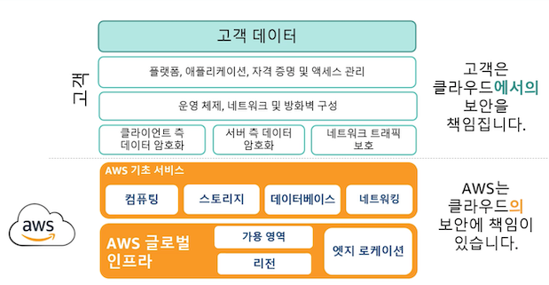
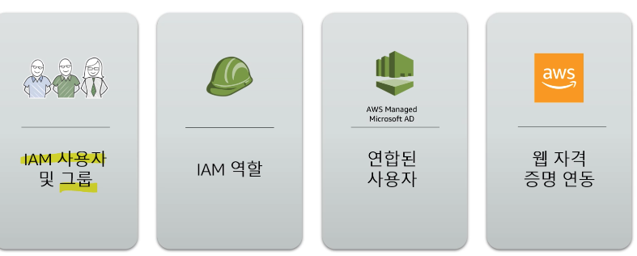
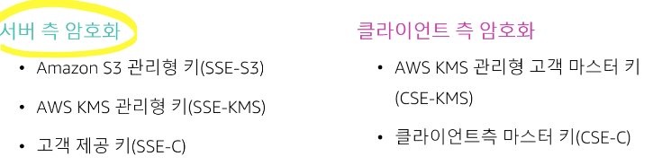
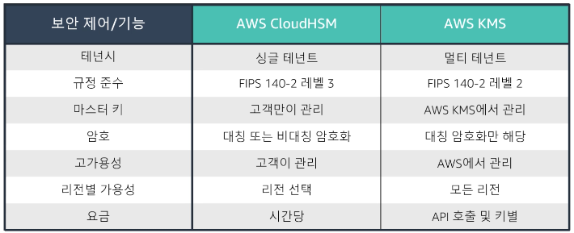
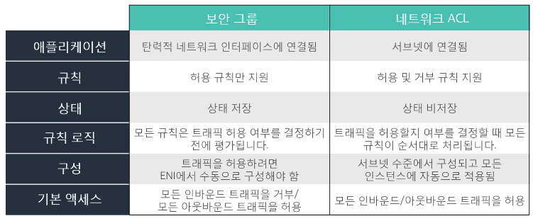
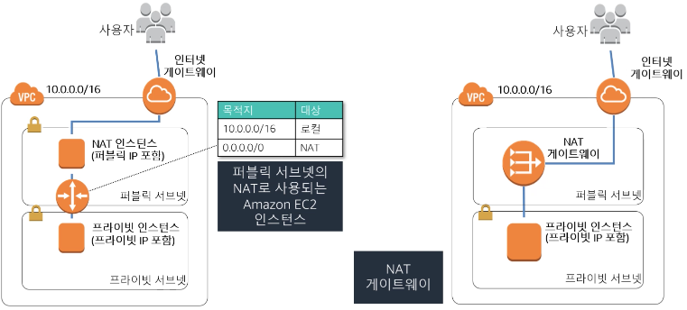

# AWS 공인 솔루션스 아키텍트 3영역(어소시에이트)

### 1. 애플리케이션 티어를 보호하는 방법 결정

---

- 공동 책임 모델

    

- 자격 증명

    

- AWS Identity and Access Management (IAM)
    - 사용자 및 사용자 권한을 중앙에서 관리
    - 사용자/애플리케이션이 액세스 할 수 있는 AWS 리소스를 제어
    - 사용자, 그룹, 역할 및 정책을 생성
    - Microsoft Active Directory 및 
    AWS Directory Service와 통합
    - 최소 권한의 원칙 적용

### 2. 데이터 보호 방법 결정

---

- 전송 중 데이터
    - AWS 인프라 안과 밖에서 데이터 전송
        - 웹을 통한 SSL/TLS
        - 온프레미스 연결용 IPsec (VPN , AWS Direct Connect)
        - 가져오기/내보내기/스노우볼
    - AWS API에 전송된 데이터
        - AWS API 호출이 HTTPS를 사용
        - 모든 호출을 Sigv4로 서명

- AWS Key Management System (AWS KMS)
    - 암호화 키 관리 서비스
    - 고객 키 구성 요소를 가져오도록 허용
    - 키 암호화/암호 해독을 위해 애플리케이션으로부터 직접 호출을 수락
    - 자동으로 키를 교체하고 이전 키를 관리

- 저장 데이터
    - S3에 저장된 데이터는 기본적으로 프라이빗, 액세스 하려면 AWS 자격 증명 필요
        - HTTP 또는 HTTPS를 통한 액세스
        - 모든 객체에 대한 액세스 감사
        - 리소스 기반 정책을 지원 (버킷, 접두사, 객체)
    - S3 저장 데이터 암호화

        

- AWS CloudHSM
    - 하드웨어 기반 키 관리
    - 키를 안전하게 생성하고 저장
    - 애플리케이션에서 직접 사용
    - 고객만이 키 관리
- Amazon RDS 암호화
    - 저장 데이터는 KMS 혹은 CloudHSM으로 암호화
    - 전송중인 데이터는 SSL/TLS를 사용하여 암호화
    - Oracle과 SQL Server에서는 TDE를 사용하여 암호화
    - 이미 만들어져 있는 DB를 암호화하는 절차
        - 스냅샷 작성 → 암호화 복제 → 복제된 암호화 스냅샷으로부터 DB 복원

- AWS CloudHSM와 AWS KMS 비교

    

### 3. 단일 VPC 애플리케이션을 위한 네트워킹 인프라 정의

---

- VPC
    - 보안 - 액세스 제어 목록, 보안 그룹
    - 네트워크 격리 - 인터넷 게이트웨이, 가상프라이빗 게이트웨이, NAT 게이트웨이
    - IP 주소 관리
    - 인터넷 액세스 가능성 - 서브넷
    - 라우팅

- 프라이빗 서브넷
    - 인터넷 게이트웨이에 대한 라우팅 테이블 항목이 없음
    - NAT을 통해 퍼블릭 인터넷에 간접 액세스
- 퍼블릭 서브넷
    - 퍼블릭 인터넷에 대한 직접 액세스를 지원
    - 인터넷 게이트웨이에 대한 라우팅 테이블 항목에 의해 지정됨
- 보안 그룹 vs 네트워크 엑세스 제어 목록

- Amazon VPC 연결 (VPC 안과 밖에서 트래픽을 가져오는 서비스 파악)
    - 인터넷 게이트웨이 : 인터넷에 연결
    - 가상 프라이빗 게이트웨이 : VPN/Direct Connect 종단 지점에 연결
    - AWS Direct Connect : 온프레미스 네트워크에 연결되는 전용 네트워킹 연결
    - VPC 피어링 : 다른 VPC에 연결
    - NAT 게이트웨이 : 프라이빗 서브넷이 인터넷에 간접 액세스하도록 허용
- 프라이빗 인스턴스의 아웃반운드 트래픽

    

    시험 고려 사항

    - AWS 계정 루트 사용자는 사용 금지
    - 보안 그룹은 허용만, 네트워크 ACL은 명시적 거부
    - 액세스 키보다 IAM 역할 선호
