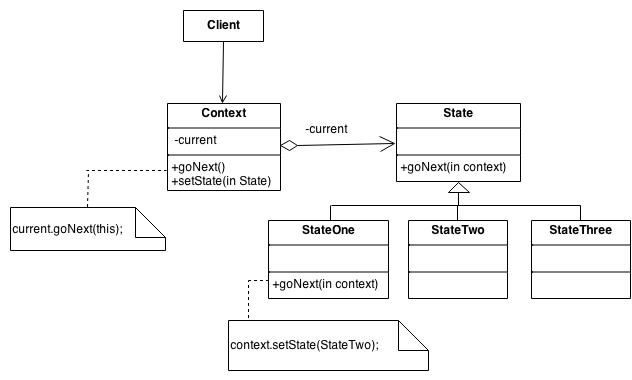

# Enum 을 인터페이스로 ? (State 패턴)
- 자바에서 어떠한 상태 값이나 상수의 개념을 나타낼 때 주로 Enum (열거형)을 많이 사용합니다.
- Enum은 상수의 집합이면서 상수에 행위(메서드)를 만들 수 있는 특징을 가지고 있는데 이러한 특징을 이용하여 각 상수 별 행위를 구현하여 
**상태와 행위를 한곳에서 관리** 할 수 있다는 장점을 가지고 있습니다.  
> 하지만 상태(상수)에 따른 행위(메서드)가 점점 확장된다면 어떻게 될까요 ?  

- 아마 우리는 엄청난 라인의 중복 코드를 만나게 될 것입니다. 
이러한 문제점을 해결하기 위해 Enum 대신 인터페이스를 사용하는 전략 패턴이 State 패턴 입니다.

## State 패턴 
- State 패턴 이란 상태가 바뀜에 따라 그 행동을 바꾸게 설계하는 소프트웨어 디자인 패턴입니다.

## 출처
- https://sourcemaking.com/design_patterns/state
