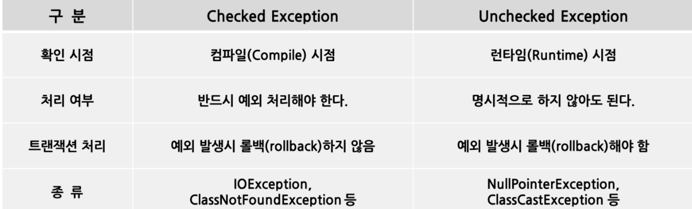

# 예외와 에러의 차이

## 예외
- 예외란 입력 값에 대한 처리가 불가능하거나, 프로그램 실행 중에 참조된 값이 잘못된 경우 등 정상적인 프로그램의 흐름을 어긋나는 것을 말한다.
- 자바에서 예외는 개발자가 직접 처리할 수 있기 때문에 예외 상황을 미리 예측하여 핸들링할 수 있다.

### 예외의 종류  
- 예외에서 RuntimeException을 상속하지 않는 클래스는 **Checked Exception**, 반대로 상속한 클래스는 **Unchecked Exception**으로 분류할 수 있다.

## 에러
- 에러는 시스템에 무엇인가 비정상적인 상황이 발생한 경우에 사용된다.
- 주로 JVM에서 발생시키는 것이며 예외와 반대로 이를 애플리케이션 코드에서 잡으려고 하면 안 된다.
- 에러의 예로는 OutOfMemoryError, ThreadDeath, StackOverflowError 등이 있다.
