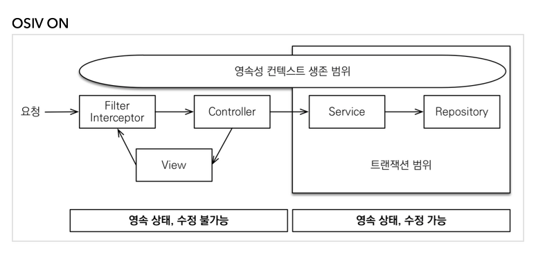

# OSIV (OpenSessionInView)

## OSIV란
- OSIV는 클라이언트의 요청이 들어올 때 영속성 컨텍스트를 생성해서 뷰(View)까지 같은 영속성 컨텍스트를 유지한다는 뜻입니다.  
  따라서, 조회한 엔티티가 있다면 프리젠테이션 계층까지 영속상태를 유지하게 됩니다.
- OSIV를 사용하지 않는다면 영속성 컨텍스트의 생존 범위는 트랜잭션과 일치합니다. (JPA 기본 전략)  

## OSIV를 사용하는 이유
- OSIV의 핵심은 뷰에서도 지연 로딩이 가능하도록 하는 것입니다.
- 조회한 엔티티가 영속 상태를 유지하기 때문에 `트랜잭션 없이 읽기`를 통해 지연로딩을 수행할 수 있습니다.
- 트랜잭션이 없기 때문에 엔티티의 변경이 일어나도 데이터베이스에 아무런 영향을 끼치지 않습니다.

## OSIV의 단점
- OSIV를 적용하여 여러 트랜잭션이 하나의 영속성 컨텍스트를 공유할 수 있는 점을 주의해야합니다. 
  - 트랜잭션 롤백의 경우 데이터베이스의 반영사항만 롤백하는 것이지 자바 객체까지 원상태로 복구해주지 않습니다.
  - 따라서 롤백된 영속성 컨텍스트를 그대로 사용하는 것은 매우 위험하고, 스프링은 트랜잭션 롤백 시 영속성 컨텍스트를 초기화하는 방법으로 예방하고 있습니다. `org.springframework.orm.jpa.JpaTransactionManager.doRollback()`
- OSIV를 사용하면 화면을 출력할 때 엔티티를 유지하면서 객채 그래프를 탐색할 수 있지만 
  복잡한 통계 화면 같은 경우 엔티티로 조회하기보다는 처음부터 통계 데이터를 구상하기 위한 JPQL을 작성해서 DTO로 조회하는 것이 효과적입니다.
- OSIV는 같은 JVM을 벗어난 원격 상황에서는 사용할 수 없습니다.
- 데이터베이스의 커넥션을 계속 열어두기 때문에 커넥션 풀에 대한 부분을 신경써야합니다.

## OSIV를 사용하지 않는 경우
스프링에서는 기본 설정으로 OSIV 설정은 사용 상태이지만 개발자가 이 설정을 사용하지 않도록 설정할 수 있습니다. 이 때, 스프링에서 JPA를 사용한다면 기본적으로 트랜잭션 범위의 영속성 컨텍스트 전략이 적용됩니다. 즉, 트랜잭션의 범위와 영속성 컨텍스트의 생존 범위가 같기 때문에 프리젠테이션에서의 엔티티는 준영속 상태가 되므로 지연로딩을 할 수 없습니다.  

## 참고  
- 자바 표준 ORM JPA 프로그래밍 (김영한)
