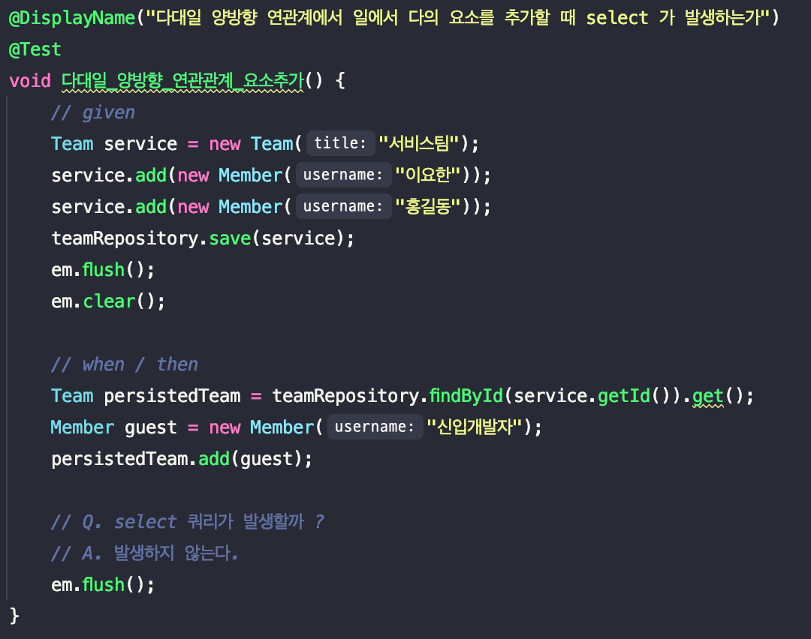
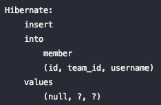
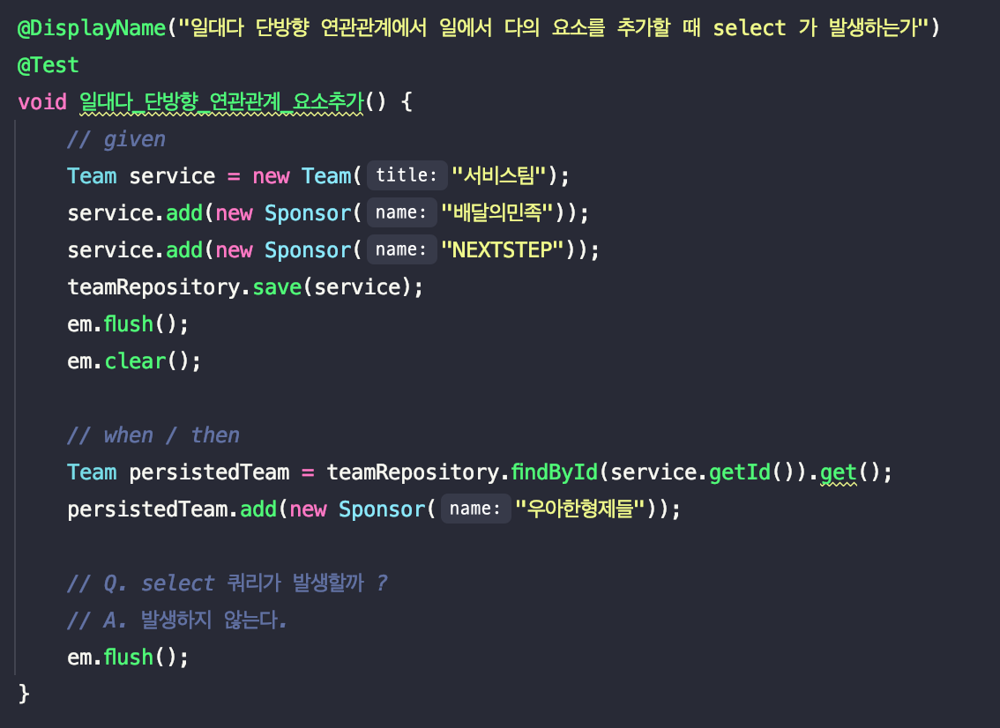
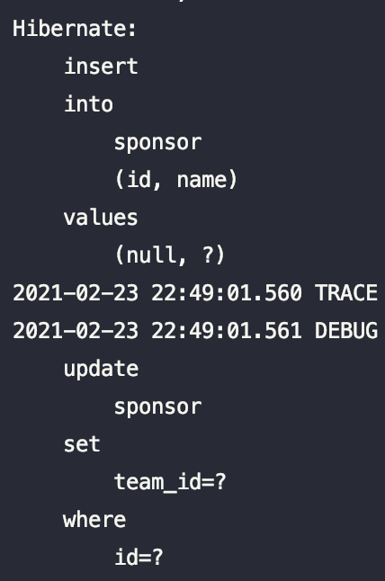
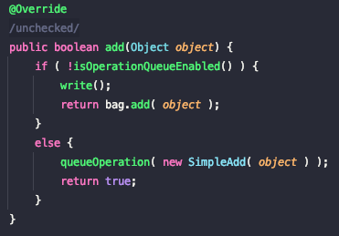
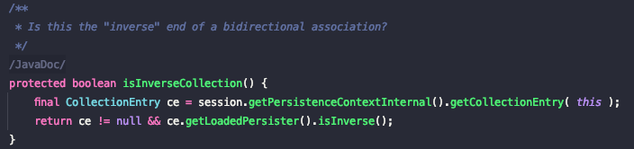

# 다양한 연관관계에서 다(Many)의 요소를 추가할 때 지연로딩이 초기화 될까?

## 1. 예제코드

테스트를 진행할 예제 코드는 다음과 같습니다.
각 연관관계 별 확인을 위해 `Team` 과 `Member`는 ManyToOne 양방향 관계를,  `Team`과 `Sponser`는 OneToMany 단방향 관계를 설정하였습니다.

**Team**

```java
@Getter
@NoArgsConstructor(access = PROTECTED)
@Entity
public class Team {

    @Id
    @GeneratedValue(strategy = GenerationType.IDENTITY)
    @Column(name = "team_id")
    private Long id;

    private String title;

    @OneToMany(mappedBy = "team", cascade = CascadeType.ALL, orphanRemoval = true)
    private List<Member> members = new ArrayList<>();

    @OneToMany(cascade = CascadeType.ALL, orphanRemoval = true)
    @JoinColumn(name = "team_id")
    private List<Sponsor> sponsors = new ArrayList<>();

    public Team(final String title) {
        this.title = title;
    }

    public void add(final Member member) {
		member.join(this);
        this.members.add(member);
    }

    public void add(final Sponsor sponsor) {
        this.sponsors.add(sponsor);
    }
}
```

**Member**

```java
@EqualsAndHashCode(of = "id")
@Getter
@NoArgsConstructor(access = PROTECTED)
@Entity
public class Member {

    @Id
    @GeneratedValue(strategy = GenerationType.IDENTITY)
    private Long id;

    private String username;

    @ManyToOne
    @JoinColumn(name = "team_id")
    private Team team;

    public Member(String username) {
        this.username = username;
    }

    public void join(Team team) {
        this.team = team;
    }
}
```

**Sponsor**

```java
@EqualsAndHashCode(of = "id")
@Getter
@NoArgsConstructor(access = PROTECTED)
@Entity
public class Sponsor {

    @Id
    @GeneratedValue(strategy = GenerationType.IDENTITY)
    private Long id;

    private String name;

    public Sponsor(final String name) {
        this.name = name;
    }
}
```

## 2. 문제확인

### 2-1. ManyToOne 양방향 관계

ManyToOne 연관관계의 테스트를 작성해보면 아래와 같습니다.



테스트를 실행해보게 되면?



Member에 대한 select 쿼리는 발생하지 않고 insert 쿼리만 발생했습니다. 
즉, **지연로딩에 대한 초기화 없이 변경감지가 동작**해서 새로운 Member가 추가된 것입니다.

그렇다면 OneToMany 단방향 관계도 테스트해보겠습니다.

### 2-2. OneToMany 단방향 관계

OneToMany 단방향 연관관계의 테스트를 작성해보면 아래와 같습니다.



테스트를 실행해보게 되면?



select 쿼리가 발생하였는데, 그 시점이 조금 이상해보입니다. 발생하더라도 `em.flush()` 일 것이라 예상 하였는데요, 예상치 못한 `persistedTeam.add(new Sponsor("우아한형제들"))` 에서 발생하였습니다. 

### 2.3 문제 원인

이 문제에 대한 원인은 하이버네이트가 엔티티를 영속 상태로 만들 때 컬렉션 필드를 하이버네이트에서 준비한 컬렉션으로 래핑하는 클래스에 있었습니다.

아래는 위 예제의 List를 감싸고있는 하이버네이트의 구현체인 PersistentBag의 코드입니다.



큐(쓰기 지연 SQL 저장소와 연관이 있는 듯 합니다)를 사용할 수 있는지 여부에 따라서 두개의 분기가 나누어져 있습니다.

1. if 로직: 컬렉션을 초기화한다.

2. else 로직: 큐에 추가한다. 

boolean을 반환하는 `isOperationQueueEnabled()` 구현에 들어가 보면 아래 연관관계에 대한 And 조건이 있습니다.



해당 로직을 통해 추가하는 컬렉션이 연관관계의 역이라면 컬렉션을 초기화하는 것을 알게 되었습니다.

> 연관관계의 역이란 외래키를 주 테이블의 엔티티가 아닌 대상 테이블의 엔티티에서 관리하는 것을 이야기합니다.  
이 부분에 대한 자세한 내용은 JPA의 연관관계의 주인을 찾아보시기를 추천드립니다. :)

## 3. 마무리

문제에 대한 답을 정리해보겠습니다.

1. ManyToOne 양방향 연관관계는 연관관계의 역이 아니므로 컬렉션을 초기화하지 않는다.
2. OneToMany 단방향 연관관계는 연관관계의 역이므로 컬렉션을 초기화한다.

그리고 1번과 같이 엔티티를 추가할 때 컬렉션을 초기화하지 않는 이유는 국내 JPA의 아버지라 불리는 김영한님의 책에서 찾을 수 있었습니다.

> Collection, List는 엔티티를 추가할 때 중복된 엔티티가 있는지 비교하지 않고 단순히 저장만 하면 된다. 따라서 엔티티를 추가해도 지연 로딩된 컬렉션을 초기화
하지 않는다.

이렇게 정리해보니 김영한님의 조언과 같이 OneToMany 단방향 보다는 ManyToOne 양방향을 써야하는 큰 이유가 한가지 더 생긴 것 같습니다. 🙂

## 참고
- 자바 ORM 표준 JPA 프로그래밍
