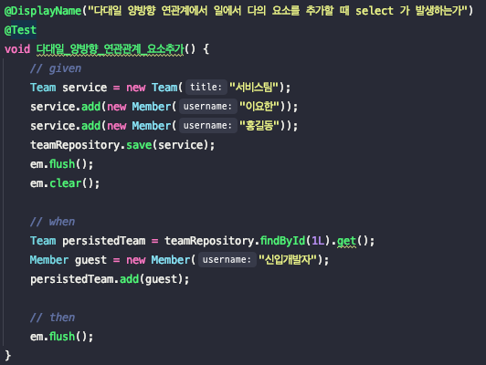
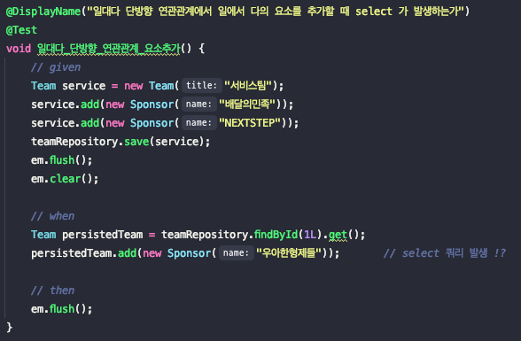

# 다양한 연관관계에서 다(Many)의 요소를 추가할 때 지연로딩이 초기화 될까?

## 1. 예제코드

테스트를 진행할 예제 코드는 다음과 같습니다.
각 연관관계 별 확인을 위해 `Team` 과 `Member`는 ManyToOne 양방향 관계를,  `Team`과 `Sponser`는 OneToMany 단방향 관계를 설정하였습니다.

**Team**

```java
@Getter
@NoArgsConstructor(access = PROTECTED)
@Entity
public class Team {

    @Id
    @GeneratedValue(strategy = GenerationType.IDENTITY)
    @Column(name = "team_id")
    private Long id;

    private String title;

    @OneToMany(mappedBy = "team", cascade = CascadeType.ALL, orphanRemoval = true)
    private List<Member> members = new ArrayList<>();

    @OneToMany(cascade = CascadeType.ALL, orphanRemoval = true)
    @JoinColumn(name = "team_id")
    private List<Sponsor> sponsors = new ArrayList<>();

    public Team(final String title) {
        this.title = title;
    }

    public void add(final Member member) {
				member.join(this);
        this.members.add(member);
    }

    public void add(final Sponsor sponsor) {
        this.sponsors.add(sponsor);
    }
}
```

**Member**

```java
@EqualsAndHashCode(of = "id")
@Getter
@NoArgsConstructor(access = PROTECTED)
@Entity
public class Member {

    @Id
    @GeneratedValue(strategy = GenerationType.IDENTITY)
    private Long id;

    private String username;

    @ManyToOne
    @JoinColumn(name = "team_id")
    private Team team;

		public Member(String username) {
        this.username = username;
    }

		public void join(Team team) {
        this.team = team;
    }
}
```

**Sponsor**

```java
@EqualsAndHashCode(of = "id")
@Getter
@NoArgsConstructor(access = PROTECTED)
@Entity
public class Sponsor {

    @Id
    @GeneratedValue(strategy = GenerationType.IDENTITY)
    private Long id;

    private String name;

    public Sponsor(final String name) {
        this.name = name;
    }
}
```

## 2. 문제확인

### 2-1. ManyToOne 양방향 관계

ManyToOne 연관관계의 테스트를 작성해보면 아래와 같습니다.



테스트를 실행해보게 되면?


select 쿼리는 발생하지 않고 insert 쿼리만 발생했습니다. 
즉, **지연로딩에 대한 초기화 없이 변경감지가 동작**해서 새로운 Member가 추가된 것입니다.

그렇다면 OneToMany 단방향 관계도 테스트해보겠습니다.

### 2-2. OneToMany 단방향 관계

OneToMany 단방향 연관관계의 테스트를 작성해보면 아래와 같습니다.



테스트를 실행해보게 되면?


테스트 결과 OneToMany 단방향 연관관계 또한 select 쿼리는 발생하지 않았습니다. 다만, 외래키를 Team에서 관리하기 때문에 update 쿼리가 추가적으로 발생된 것을 확인할 수 있었습니다.

## 3. 마무리

결국 문제에 대한 답은 아래와 같았습니다.

**다양한 연관관계에서 Many의 요소를 추가할 때 지연로딩이 초기화되지 않는다.**

이에 대한 이유는 JPA의 바이블이라 불리는 김영한님의 책에서 찾을 수 있었습니다.

> 하이버네이트는 엔티티를 영속 상태로 만들 때 컬렉션 필드를 하이버네이트에서 준비 한 컬렉션으로 감싸서 사용한다.
List를 사용하는 하이버네이트의 컬렉션은 PersistenceBag 이며 중복을 허용하고 순서를 보관하지 않는다.
Collection, List는 엔티티를 추가할 때 중복된 엔티티가 있는지 비교하지 않고 단순히 저장만 하면 된다. 따라서 엔티티를 추가해도 지연 로딩된 컬렉션을 초기화
하지 않는다.

PersistenceBag과 같은 JPA의 컬렉션에 대한 부분은 다시 한번 정리해보도록 해야겠습니다. :)

## 참고
- 자바 ORM 표준 JPA 프로그래밍
