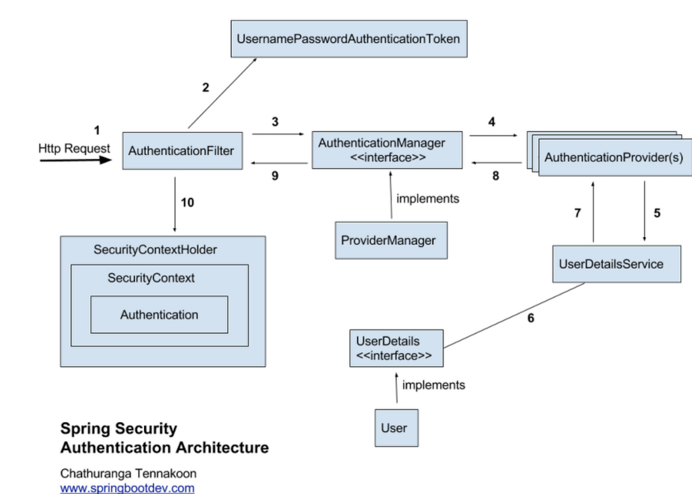

# 스프링 시큐리티 - 인증 아키텍처
  
## 인증 절차
1. 사용자가 아이디 비밀번호로 로그인 요청
2. `UsernamePasswordAuthenticationFilter(AuthenticationFilter)`에서 아직 인증되지 않은 `UsernamePasswordAuthenticationToken(Authentication)` 객체를 만듬.  
3. `ProviderManager(AuthenticationManager)`에게 `Authentication` 인증 요청 (반환 타입도 Authentication 타입)  
4. `AuthenticationManager`는 여러 `AuthenticationProvider`중 `DaoAuthenticationProvider`에게 인증 요청.  
5. `DaoAuthenticationProvider`는 `UserDetailsServivce`에 유저 정보 조회를 요청.
6. `UserDetailsServivce`는 인메모리 DB나 외부 DB 등을 통해 조회한 `UserDetails`를 가져옴.
7. `DaoAuthenticationProvider` 에게 조회된 `UserDetails` 반환.
8. `DaoAuthenticationProvider` 에서 `passwordEncoder`로 인증이 되었는가를 처리 후 인증 된 `Authentication` 반환 
9. 인증된 `Authentication`를 `AuthenticationFilter`에게 반환.
10. 인증된 `Authentication`를 `SecurityContextHolder`에 저장하고 `AuthenticationSuccessHandle`를 실행.(실패 시 AuthenticationFailureHandler 실행)

### SecurityContextHolder & Authentication  

- **SecurityContextHolder**
    - 누가 인증 되었는지에 대한 세부 정보를 저장하는 곳
    - SecurityContext를 제공하며 기본적으로 ThreadLocal(한 쓰레드 내에 공유되는 자원) 사용.
- **SecurityContext**
    - Authentication 제공.
- **Authentication**
    - 인증된 사용자 정보인 Principal(인증 주체)과 GrantAuthority(주체 권한) 제공.  
- **Principal**
    - 인증한 사용자에 해당하는 정보. UserDetailsService에서 반환한 객체이며, UserDetails 타입.
- **GrantAuthority**
    - Principal(인증한 사용자)가 가지고 있는 권한(“ROLE_USER”, “ROLE_ADMIN”), 인증 이후 인가 및 권한 확인 시 사용
    
- **UserDetails**
    - 애플리케이션이 가지고 있는 유저 정보(User)와 스프링 시큐리티가 사용하는 Authentication 객체 사이의 어댑터 역할을 하는 인터페이스.
    - UserDetailsService를 통해 UserDetails를 구현한 User를 반환하면서 이 반환 값을 토대로 Authentication 구현체를 생성하기 위해 사용된다.
    - 일반적으로 직접 개발한 UserVO 모델에 implements 하여 사용하기도 한다.
- **UserDetailsService**
    - UserDetails 객체를 반환하는 메소드를 가진 인터페이스.
    - 일반적으로 이를 구현한 클래스 내부에 외부 DB와 연결하여 UserDetails 객체를 생성하여 반환한다.
