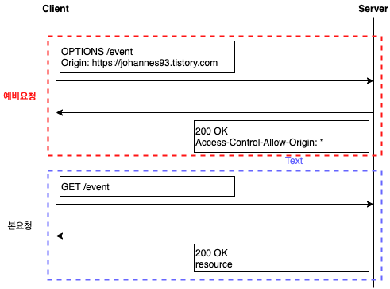

# CORS(Cross-Origin Resource Sharing)

## 1. CORS란 무엇인가?

CORS는 Cross-Origin Resource Sharing의 줄임말로 해석하면 교차 출처 리소스 공유이다. 
기본적으로 웹에서는 `SOP(Same-Origin Policy)`라는 정책을 가지고 있는데 이 정책은 같은 출처에서만 리소스를 공유할 수 있다라는 규칙을 가지고 있다. 

하지만 우리는 개발하면서 다른 출처로 리소스를 제공해야하는 공공적인 API를 개발하거나 하는 일들이 있는데 이 때 CORS를 설정하게 된면 다른 출처에 리소스를 제공할 수 있게된다. 하지만 CORS를 설정해준다면 CSRF 공격과 같은 보안이 취약해지는 상황이 있을 수 있기 때문에 주의해야한다.

## 2. CORS 동작 방식

CORS의 기본적인 동작 방식은 아래와 같고 방식의 종류는 세 가지가 있다.

1. 클라이언트에서 요청을 보낼때 요청 헤더에 `Origin`이라는 필드에 요청을 보내는 출처를 함께 전송하게 된다.
2. 서버가 요청에 대한 응답을 할 때 응답 헤더의 Access-Control-Allow-Origin이라는 값에 “이 리소스를 접근하는 것이 허용된 출처”를 추가하여 응답한다.
3. 응답을 받은 브라우저는 자신이 보냈던 요청의 Origin과 서버가 보내준 응답의 Access-Control-Allow-Origin을 비교해본 후 이 응답이 유효한 응답인지 아닌지를 결정한다.

### 2-1. Preflight Request

Preflight 방식은 일반적으로 우리가 웹 어플리케이션을 개발할 때 일반적으로 사용되는 방식이다. 해당 방식에서는 브라우저는 요청을 한번에 보내지 않고 예비 요청과 본 요청으로 나누어서 서버에 전송한다.

보통 예비 요청을 Preflight라고 부르며, HTTP 메소드 OPTIONS 메소드가 사용된다. 예비 요청의 역할은 본 요청을 보내기 전에 브라우저 스스로 요청을 보내는 것이 안전한지에 대한 확인을 하는 것이다.

서버에서는 OPTIONS 요청에 대한 허용 또한 서버에서 설정이 가능하다.

### 2-2. Simple Request

단순 요청의 경우는 예비 요청을 보내지 않고 바로 서버에게 본 요청을 한 후, 서버가 응답한 헤더의 Acess-Control-Allow-Origin를 확인하여 CORS 정책 위반 여부를 검사하는 방식이다. 

즉, Preflight 방식에서 예비요청 없이 본요청만을 수행하는 것이다.

### 2-3. Credentialed Request

해당 방식은 인증된 요청을 사용하는 방법이다. 이는 CORS의 기본적인 방식이라기 보다 다른 출처 간 통신에서 좀 더 보안을 강화하고 싶을 때 사용하는 방법이다.

이 방법은 주로 요청에 인증과 관련된 노출에 민감한 정보를 담아 사용할 때 설정할 수 있는 브라우저는 다른 출처의 리소스를 요청할 때 단순히 Access-Control-Allow-Origin만 확인하는 것이 아니라 좀 더 빡빡한 검사 조건을 추가하게 된다.

기본적으로 브라우저가 제공하는 비동기 리소스 요청 API인 XMLHttpRequest 객체나 fetch API는 별도의 옵션 없이 브라우저의 쿠키 정보나 인증과 관련된 헤더를 함부로 요청에 담지 않지만 credentials 옵션을 사용하게 되면 이때 요청에 인증과 관련된 정보를 담을 수 있게 된다.

## 3. CORS 정책 위반 시 해결 방법

CORS 정책 위반으로 인한 문제를 해결하는 가장 대표적인 방법은 서버에서 Access-Control-Allow-Origin 헤더에 알맞은 값을 세팅해주는 것으로 해결할 수 있다.

그 외에 방법으로 개발 중인 환경에서 로컬 환경에서 접근하기위해 CORS 설정이 필요하다면 웹팩에서 프록시 기능을 사용하거나 임시로 서버에서 열어주는 방법으로 해결할  수 있다.

## 참고

- [https://evan-moon.github.io/2020/05/21/about-cors/#cors는-어떻게-동작하나요](https://evan-moon.github.io/2020/05/21/about-cors/#cors%EB%8A%94-%EC%96%B4%EB%96%BB%EA%B2%8C-%EB%8F%99%EC%9E%91%ED%95%98%EB%82%98%EC%9A%94)
