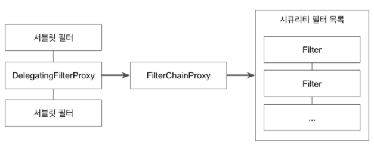

# 스프링 시큐리티 - 필터
## 스프링 시큐리티 필터의 간략한 구조
  

-  DelegatingFilterProxy
    - 스프링 부트를 쓴다면 자동으로 등록.
    - Bean 이름이 springSecurityFilterChain인 `FilterChanProxy` 객체를 등록하여 필터 처리를 위임.
    
- FilterChainProxy
    - `List<SecurityFilterChain>`를 가지고 있는 객체.
    - 요청에 알맞은 필터를 찾아 적용.
    
## 시큐리티 필터 목록은 어떻게 구성되는가 ?
    - WebSecurity 나 HttpSecurity 설정을 통해 구성됨.
    - WebSecurity docs
        The {@link WebSecurity} is created by {@link WebSecurityConfiguration} to create the
         * {@link FilterChainProxy} known as the Spring Security Filter Chain
         * (springSecurityFilterChain). The springSecurityFilterChain is the {@link Filter} that
         * the {@link DelegatingFilterProxy} delegates to.
     
  
## 주요 필터 목록 (기본 순서) 
  - [WebAsyncManagerIntegrationFilter](https://github.com/leeyohan93/TIL/blob/master/spring/security/filters/WebAsyncManagerIntegrationFilter.md)
    - Spring MVC에서 Async 관련 기능을 사용하여 다른 하위 Thread 에서도 같은 SpringSecurityContext를 공유할 수 있도록 해준다.
  - [SecurityContextPersistenceFilter](https://github.com/leeyohan93/TIL/blob/master/spring/security/filters/SecurityContextPersistenceFilter.md)
    - 여러 요청 간에 SecuirtyContext를 공유할 수 있도록 해주는 필터.
    - 기본적으로 httpSession 에서 SecurityContext 정보를 가져온다. 
  - [HeaderWriterFilter](https://github.com/leeyohan93/TIL/blob/master/spring/security/filters/HeaderWriterFilter.md)
    - 응답 헤더에 시큐리티 관련 정보들을 추가해주는 필터.
  - [CsrfFilter](https://github.com/leeyohan93/TIL/blob/master/spring/security/filters/CsrfFilter.md)
    - Csrf 공격을 방지하는 필터.
  - [LogoutFilter](https://github.com/leeyohan93/TIL/blob/master/spring/security/filters/LogoutFilter.md)
    - 로그아웃 처리를 하는 필터.
  - [UsernamePasswordAuthenticationFilter](https://github.com/leeyohan93/TIL/blob/master/spring/security/Authentication.md)
    - 폼 인증 처리 필터.
  - [DefaultLogin/LogoutPageGeneratingFilter](https://github.com/leeyohan93/TIL/blob/master/spring/security/DefaultLogin-LogoutPageGeneratingFilter.md)
    - 기본 로그인 폼페이지와 `GET /login` 요청, 로그아웃 폼 페이지와 `GET /logout` 요청을 처리하는 필터.
  - [BasicAuthenticationFilter](https://github.com/leeyohan93/TIL/blob/master/spring/security/BasicAuthenticationFilter.md)
    - Basic 인증에 대한 처리를 하는 필터. 보안에 취약하기에 반드시 HTTPS를 사용 권장.
  - RequestCacheAwareFilter
    - 현재 요청과 관련 있는 캐시된 요청이 있는지 찾아서 적용하는 필터. (캐시된 요청이 있다면 해당 캐시된 요청 처리)
    - referer와 관련, 대시보드 접근 -> 인증필요 -> 로그인페이지 -> 로그인 -> **대시보드** (대시보드로드 가야한다는 요청을 캐싱)
  - SecurityContextHolderAwareRequestFilter
    - 시큐리티 관련 서블릿 API를 구현해주는 필터
  - AnonymousAuthenticationFilter
    - 인증이 안된 유저를 Anonymous Authentication 을 만들어 넣어주는 필터 (기본으로 만들어 사용할 익명 Authentication 객체 설정 가능)
    - null object pattern, 인증되지 않은 유저를 null이 아닌 anonymous 로 대변한다.
  - [SessionManagementFilter](https://github.com/leeyohan93/TIL/blob/master/spring/security/SessionManagementFilter.md)
    - 세션의 보안에 관한 여러가지 일을 하는 필터.
    
    
  - FilterSecurityInterceptor : 인가 처리, 필터 순서 마지막에 위치함.
  - ExceptionTranslationFilter : 인증, 인가 Exception 처리.
  
  
- 참고
  - [스프링 시큐리티 - 백기선님](https://www.inflearn.com/course/%EB%B0%B1%EA%B8%B0%EC%84%A0-%EC%8A%A4%ED%94%84%EB%A7%81-%EC%8B%9C%ED%81%90%EB%A6%AC%ED%8B%B0/dashboard)

       

