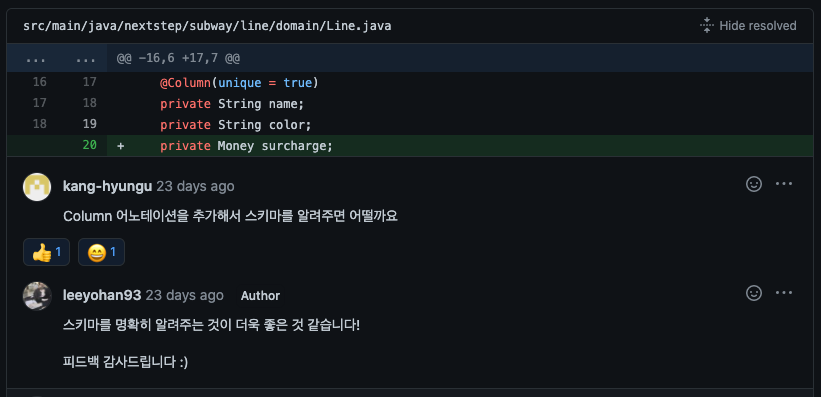
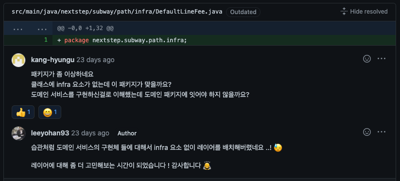
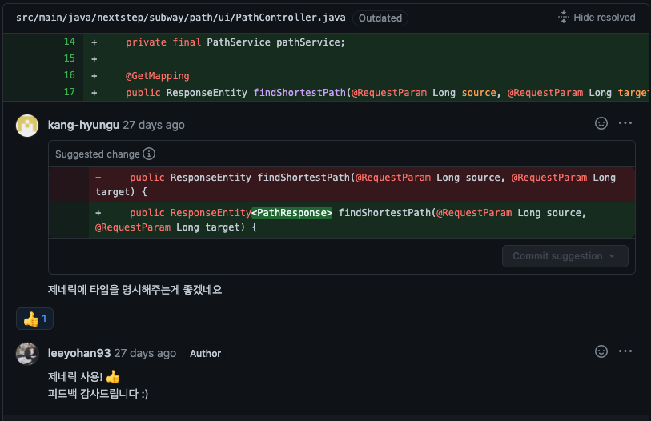
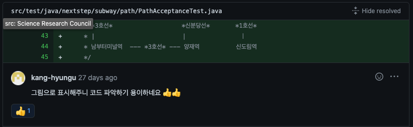
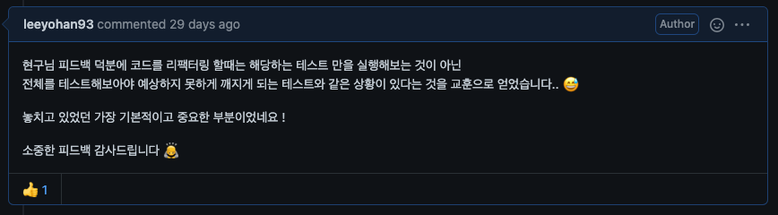
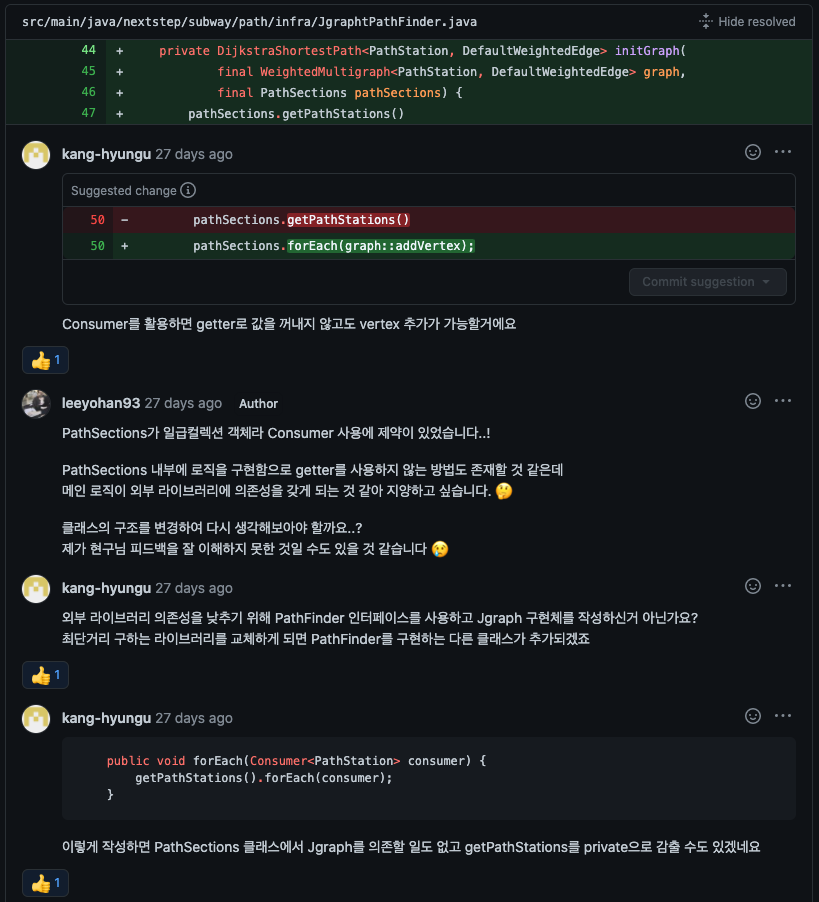

# 인수테스트 기반 TDD

- [Repository](https://github.com/leeyohan93/atdd-subway-service)
- [Step1 PullRequest](https://github.com/next-step/atdd-subway-service/pull/12)
- [Step2 PullRequest](https://github.com/next-step/atdd-subway-service/pull/17)
- [Step3 PullRequest](https://github.com/next-step/atdd-subway-service/pull/27)
- [Step4 PullRequest](https://github.com/next-step/atdd-subway-service/pull/43)

## 피드백 모음

### 다른 애그리거트를 참조하는 것은 문제가 아니다. 중요한 것은 도메인 룰에 대한 책임을 적절한 애그리거트가 가지는 것이다.

### 엔티티 작성 시 컬럼의 명확한 매핑을 위한 어노테이션을 사용하라

### 인프라 레이어에는 외부 API 나 라이브러리와 같은 외부 의존성을 가질때 사용한다.
 

### 제네릭을 사용하라

### 테스트가 복잡하다면 주석을 활용하라

### 사이드 이펙트를 항상 조심하라

### Cousumer 활용

