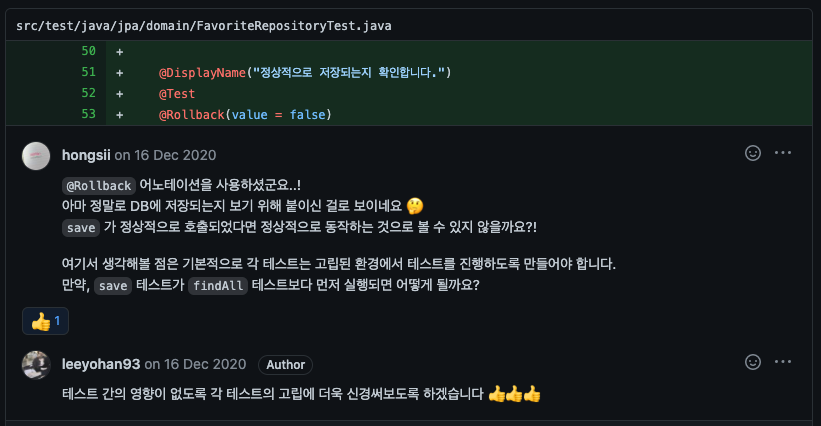
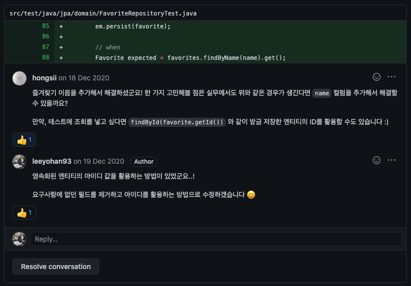
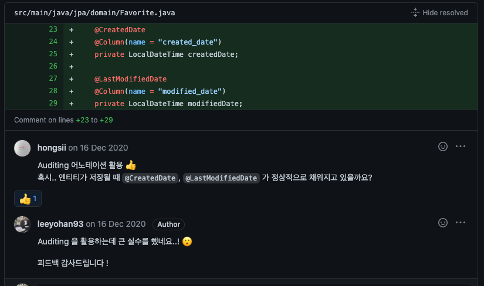
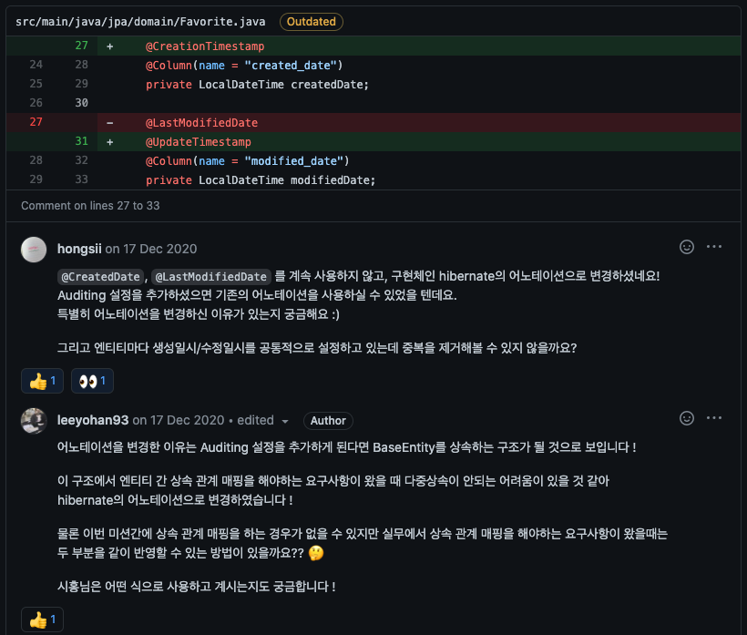
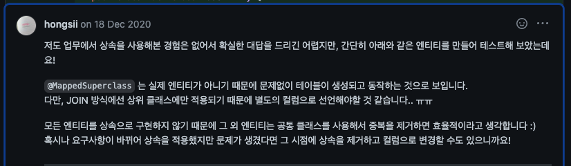
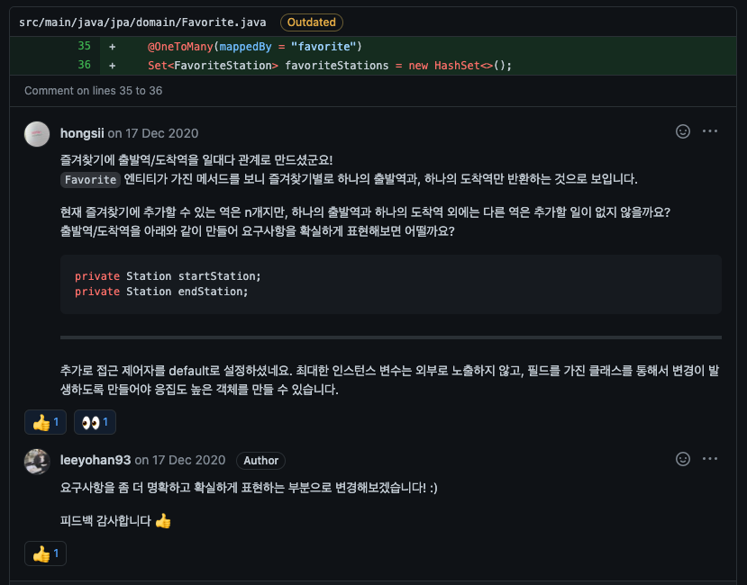
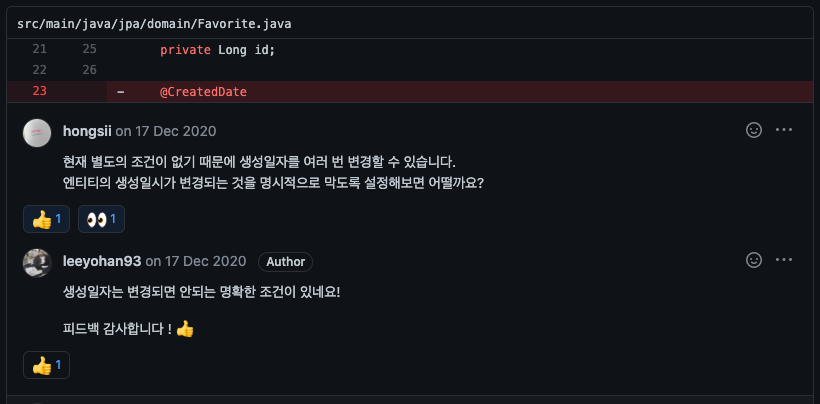
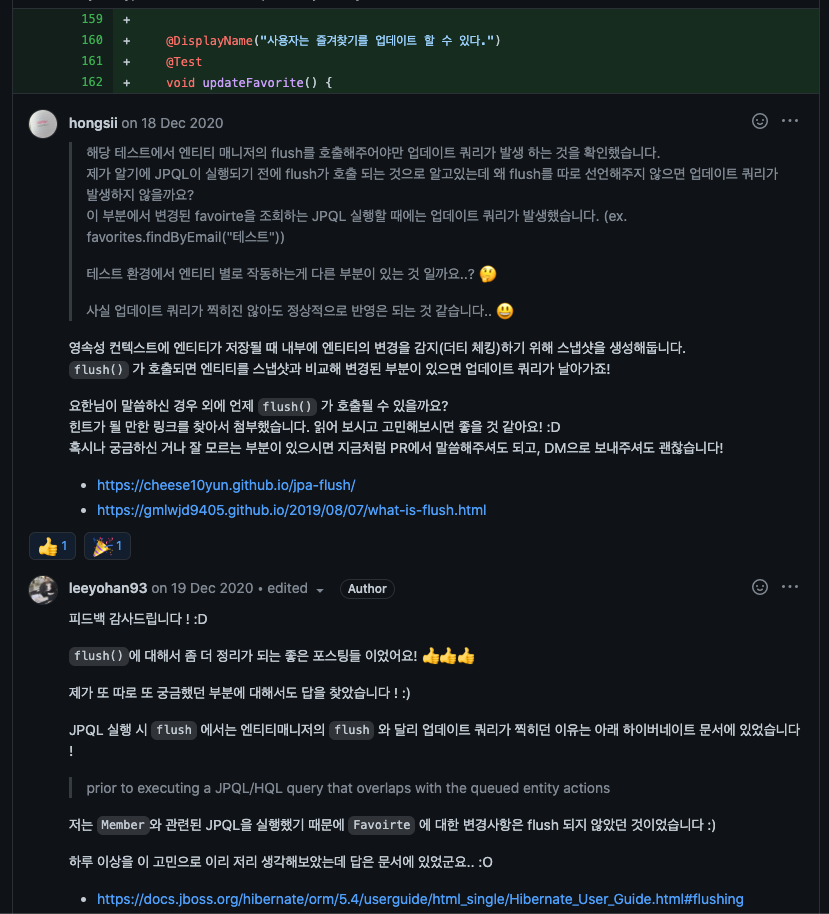
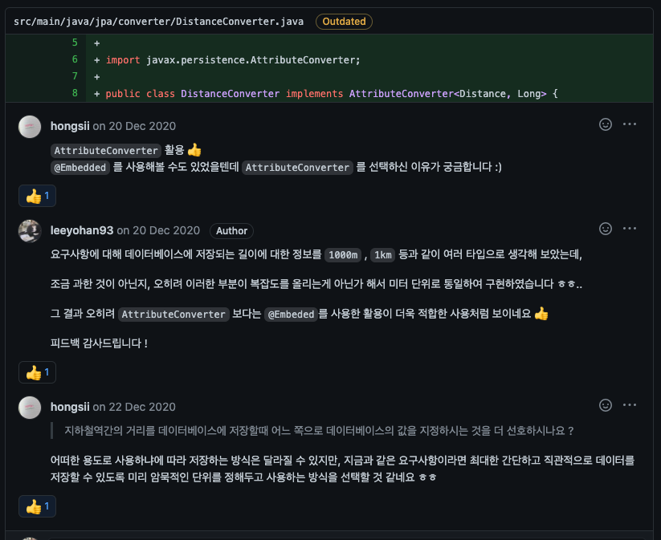
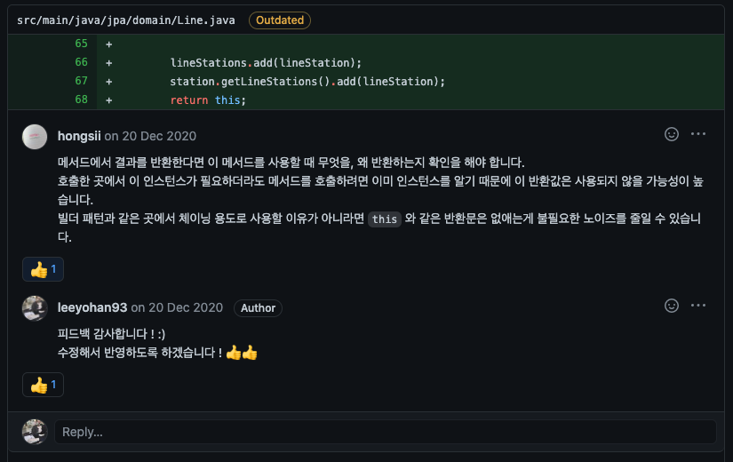

# JPA

- [Repository](https://github.com/leeyohan93/jwp-jpa)
- [Step1 PullRequest](https://github.com/next-step/jwp-jpa/pull/4)
- [Step2 PullRequest](https://github.com/next-step/jwp-jpa/pull/7)
- [Step3 PullRequest](https://github.com/next-step/jwp-jpa/pull/27)

## 피드백 모음
### DataJpaTest 고립

    
### DataJpaTest 팁

    
### Auditing

    
### Auditing vs Hibernate

[테이블 & 엔티티 예시](https://github.com/next-step/jwp-jpa/pull/7#discussion_r545772880)
    
### @JoinColumn 사용법

    
### 명시적으로 데이터의 변경을 막기

    
### [JPQL 실행 시 일부 엔티티에 대한 쿼리만 실행된다?](https://github.com/leeyohan93/TIL/blob/master/spring/jpa/JpqlFlush.md)

    
### AttributeConverter vs Embedded

    
### 메서드의 반환

