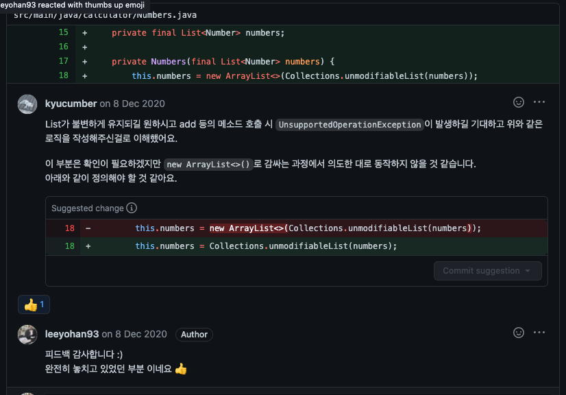
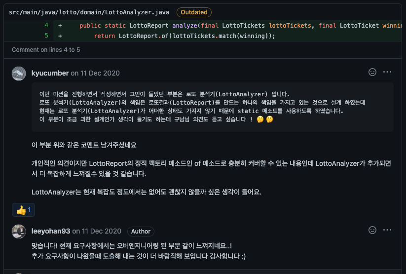

# 로또 - TDD

- [Repository](https://github.com/leeyohan93/java-lotto)
- [Step1 PullRequest](https://github.com/next-step/java-lotto/pull/1028)
- [Step2 PullRequest](https://github.com/next-step/java-lotto/pull/1042)
- [Step3 PullRequest](https://github.com/next-step/java-lotto/pull/1054)
- [Step4 PullRequest](https://github.com/next-step/java-lotto/pull/1060)

## 피드백 모음

### 리스트를 불변하게 만드는 방법

### 오버엔지니어링을 주의하자

### List가 아닌 Set의 사용

## 테스트를 위한 코드(생성자)

