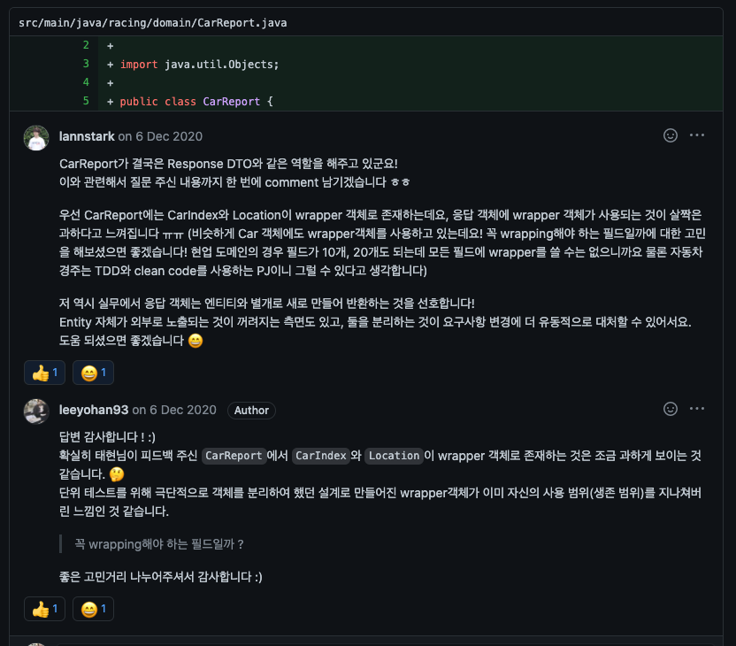

# 자동차 경주 - 단위테스트

- github: [https://github.com/leeyohan93/java-racingcar](https://github.com/leeyohan93/java-racingcar)
- step1: [https://github.com/next-step/java-racingcar/pull/1589](https://github.com/next-step/java-racingcar/pull/1589)
- step2: [https://github.com/next-step/java-racingcar/pull/1624](https://github.com/next-step/java-racingcar/pull/1624)
- step3: [https://github.com/next-step/java-racingcar/pull/1660](https://github.com/next-step/java-racingcar/pull/1660)
- step4: [https://github.com/next-step/java-racingcar/pull/1684](https://github.com/next-step/java-racingcar/pull/1684)
- step5: [https://github.com/next-step/java-racingcar/pull/1698](https://github.com/next-step/java-racingcar/pull/1698)

## 피드백 모음

### Step 3

### Step 4

### Step 5

